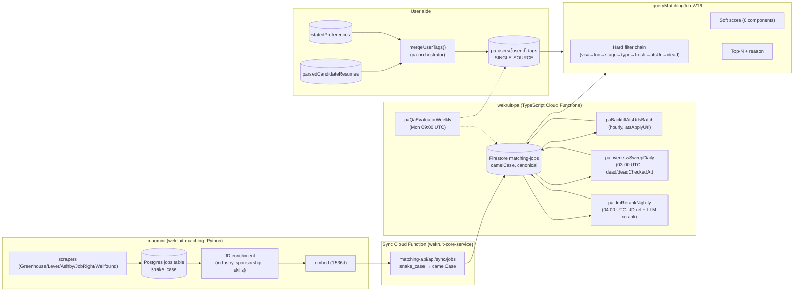
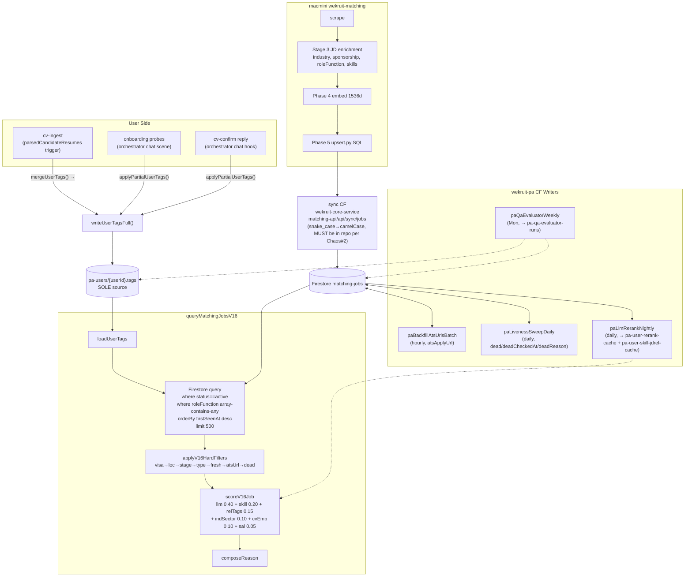

# Job Data Contract — v1.8 Alignment

**One canonical source of truth.** This document is the contract that every writer, reader, and validator across `wekruit-pa` (TypeScript) + `wekruit-matching` (macmini Python) MUST conform to. If a code path violates this contract, the code path is wrong — fix the code, not the contract.

> Adam directive (2026-05-05): "tag 必须有一个地方 manage tag, 而且我们对于工作的 enrichment / 人的 enrichment 都必须要走这个 tag, 这样他们能共享这个都不算 match... 减少 regex 判断."
>
> Adam directive (2026-05-06, "现在这个很混乱"): the system has chaos. v1.8 closes the gaps the audit at `.planning/JOB-DATA-AUDIT-2026-05-06.md` exposes.

---

## 0. The Single Mental Model (read this first)

Three fundamental truths:

1. **`matching-jobs/{jobId}` is camelCase, canonical, Firestore.** Anything that wants to write must go through the sync CF transformation OR the named writer Cloud Functions in this contract. No direct Firestore writes.
2. **`pa-users/{userId}.tags` is the SOLE source of truth for user signal.** `mergeUserTags()` (pure) is the only authority, called from cv-ingest + onboarding + cv-confirm — written via `writeUserTagsFull()` / `applyPartialUserTags()`. No other writers.
3. **Two orthogonal axes.** `roleFunction` (WHAT you do, hard filter) and `industrySector` (WHAT KIND of company, soft score) are independent. NEVER conflate them.

---

## 1. The Two Orthogonal Axes (D1 + D2, reaffirmed)

This is the most-violated past mistake. Spell it out.

### Axis 1 — `roleFunction` (D1)

- **Question it answers**: WHAT does this person do? WHAT does this job hire for?
- **Source vocab**: jobright `utm_campaign` 17 verbatim values
- **File**: `packages/shared-tags/src/canonical/role-function.ts:17`
- **Closed**: yes — never extensible. Adding a value requires source-code change + Adam approval.
- **Match semantics**: **hard filter** (`array-contains-any` at Firestore query layer)
- **User side**: `pa-users/{userId}.tags.targetRoleFunction[]` (multi-pick, capped at 10 for query)
- **Job side**: `matching-jobs/{id}.roleFunction[]` (multi-pick)
- **Cardinality**: SWE candidate at Stripe = `["software_engineering"]`. A platform engineer might be `["software_engineering", "engineering_and_development"]`.

### Axis 2 — `industrySector` (D2)

- **Question it answers**: WHAT KIND of company is this?
- **Source vocab**: extended INDUSTRY_VOCAB 38 (from `wekruit-scraping/src/wekruit_matching/enrichment/classifier.py`) + 4 v1.6 additions = **42 spelled-out values**
- **File**: `packages/shared-tags/src/canonical/industry-sector.ts:21`
- **Closed**: yes statically — but **admin-extensible** at runtime via `pa-canonical-tags` overlay (D16). New tokens proposed via sandbox → reviewed → promoted.
- **Match semantics**: **soft score** (overlap ratio, weight 0.10)
- **User side**: `pa-users/{userId}.tags.industrySector[]` + `tags.relevantIndustry[]` (≤6 from work-history)
- **Job side**: `matching-jobs/{id}.industrySector[]`
- **Cardinality**: a SWE at Stripe = `roleFunction=["software_engineering"]` AND `industrySector=["financial_technology"]`. Two independent dimensions.

### Why this matters

Past code paths conflated the two — e.g. legacy `industry` 6-enum (`tech`/`fintech`/`healthtech`/`consumer`/`b2b`/`any`) tried to encode both function AND industry into one token. That collapsed all SWE jobs into "tech" and lost signal. The v1.6 design lock split them; the v1.8 contract makes the split irreversible.

**Do not reintroduce a unified axis.** Don't try to be clever with "category" or "vertical" or any other word that mashes the two.

---

## 2. The Complete Tag Taxonomy

### 2.1 Closed Enums (compile-time, source-of-truth in `packages/shared-tags/src/canonical/`)

| Vocab | File | Count | Tokens (full list) | Match Semantics | Extensible? |
|---|---|---|---|---|---|
| `roleFunction` | `role-function.ts:17` | 17 | `software_engineering`, `engineering_and_development`, `data_analysis`, `product_management`, `business_analyst`, `creatives_and_design`, `consultant`, `accounting_and_finance`, `marketing`, `management_and_executive`, `sales`, `human_resources`, `legal_and_compliance`, `arts_and_entertainment`, `education_and_training`, `public_sector_and_government`, `customer_service_and_support` | hard_filter | NO (source-locked to jobright `utm_campaign`) |
| `industrySector` | `industry-sector.ts:21` | 42 | `artificial_intelligence_and_machine_learning`, `financial_technology`, `healthcare_and_life_sciences`, `biotechnology_and_pharmaceuticals`, `software_and_saas`, `hardware_and_semiconductors`, `e_commerce_and_retail`, `consumer_goods`, `cybersecurity`, `crypto_web3_blockchain`, `gaming_and_esports`, `education_technology`, `real_estate_and_proptech`, `transportation_and_logistics`, `automotive_and_mobility`, `aerospace_and_defense`, `energy_and_utilities`, `clean_energy_and_climate_tech`, `manufacturing_and_industrial`, `construction_and_built_environment`, `agriculture_and_foodtech`, `hospitality_and_travel`, `media_and_entertainment`, `advertising_and_marketing`, `telecommunications`, `professional_services`, `legal_services`, `accounting_and_audit`, `management_consulting`, `human_resources_and_recruiting`, `non_profit_and_social_impact`, `public_sector_and_government`, `research_and_academia`, `sports_and_recreation`, `fashion_and_apparel`, `beauty_and_personal_care`, `arts_and_culture`, `accessibility_and_assistive_technology`, `robotics_and_automation`, `quantum_computing`, `space_technology`, `technology_general` | soft_score | YES (admin-promotable via overlay) |
| `jobType` | `job-type.ts:11` | 10 | `full_time`, `internship`, `new_graduate`, `contract`, `part_time`, `fellowship`, `apprenticeship`, `freelance`, `return_to_work_program`, `co_op_rotation` | hard_filter (exact intersect) | NO |
| `careerStage` | `career-stage.ts:13` | 13 | `student`, `intern`, `entry_level`, `junior`, `mid_level`, `senior`, `staff`, `principal`, `manager`, `director`, `vp`, `c_level`, `founder` | hard_filter (window via `acceptableCareerStages`) | NO |
| `visa` | `visa.ts:19` | 4 | `citizen`, `permanent_resident`, `sponsor_needed`, `other` | hard_filter | NO (D4 — never split OPT/CPT/H1B) |
| `major` | `major.ts:14` | 65 | `computer_science`, `software_engineering` (engineering category), `electrical_engineering`, ..., `other_humanities`, `other_social_sciences`, `other_stem` (full list in file) | soft_score (D3, NOT a gate) | NO |
| `location` | `location.ts:18` | 167 | US metros (`san_francisco_bay_area`, ...), Canada, EU, APAC, LATAM, MEA, remote variants (`remote_anywhere`, `remote_united_states`, ...) | hard_filter (intersect, anywhere bypass via `ANYWHERE_LOCATION_TOKENS`) | NO |
| `skillBucket` | `skills.ts:19` | 10 | `programming_languages`, `frameworks_and_libraries`, `databases`, `cloud_and_infrastructure`, `devops_and_tooling`, `data_and_ml`, `design_and_ux`, `product_and_business`, `soft_skills`, `domain_specific` | soft_score (paired with name) | NO |
| `skillProficiency` | `skills.ts:36` | 4 | `beginner`, `intermediate`, `advanced`, `expert` | (modifier to skill weight) | NO |

**Counts here are authoritative as of 2026-05-06.** If a count diverges from the source file, the file wins — re-run the audit.

### 2.2 Open Vocabs (pattern-validated, runtime-extensible)

| Vocab | File | Pattern | Cap | Match Semantics |
|---|---|---|---|---|
| `skills.name` | `skills.ts:52` | `^[a-z][a-z0-9_+#.\-]{1,63}$` (allows `c++`, `c#`, `node.js`) | unbounded (full bag stored — never truncate) | soft_score (per-skill base × jd-rel weighted Jaccard) |
| `relevantTags` | `relevant-tags.ts:21` | `^[a-z][a-z0-9_]{1,79}$` (lowercase + underscore only) | 12 per profile | soft_score (overlap ratio, weight 0.15) |

### 2.3 Firestore Overlay (D16 admin-extensible)

- **Collection**: `pa-canonical-tags`
- **Doc ID convention**: `{vocab}__{token}` (double underscore separator) — see `overlay.ts:137`
- **File**: `packages/shared-tags/src/canonical/overlay.ts:37` (`CanonicalTagOverlaySchema`)
- **Supported vocabs**: `industry-sector` only (`OVERLAY_SUPPORTED_VOCABS` at `overlay.ts:84`)
- **Status enum**: `sandbox` | `promoted` | `rejected`
- **Resolver**: `resolveCanonicalVocab(vocab, staticVocab, db)` at `overlay.ts:97` merges static + promoted at runtime, dedupes preserving static order first.

---

## 3. The `matching-jobs` Firestore Schema Contract

**Authoritative file**: `apps/job-rec/src/types.ts:114` (`MatchingJobSchema` Zod).
**v1.6 partial schema**: `packages/core-types/src/matching-jobs.ts:33` (`MatchingJobV16PartialSchema` for the canonical additions).
**Storage**: Firestore `matching-jobs` collection, **camelCase**.

### 3.1 Required + Optional Field Inventory

| Field | Type | Required? | Source (writer) | Reader | Validation |
|---|---|---|---|---|---|
| `id` | string | YES | sync CF (mirrors macmini `job_id`) | V16 query, dashboard, liveness | doc.id presence |
| `companyName` | string | YES | sync CF (← `company_name`) | all readers, V16 reasoning | non-empty string |
| `jobTitle` | string | YES | sync CF (← `role_title`) | all readers, V16 reasoning | non-empty string |
| `primaryUrl` | string | YES | sync CF (← `primary_url`) | V16 fallback when no `atsApplyUrl`, liveness HEAD | URL-shaped string |
| `locationRaw` | string | YES | sync CF (← `location_raw`) | V16 location-fallback substring matcher | non-empty string |
| `salaryMin` | number\|null | YES | sync CF (← parse `salary_range`) | V16 `salaryFit` component | nonneg int or null |
| `salaryMax` | number\|null | YES | sync CF (← parse `salary_range`) | V16 (informational) | nonneg int or null |
| `roleFunction` | string[] | YES (post-Phase 55) | sync CF (← jobright `utm_campaign`) + Phase 55 backfill | V16 `array-contains-any` hard filter | `RoleFunctionSchema` (closed enum) |
| `industrySector` | string[] | YES (post-Phase 55) | sync CF (← Phase 53 Sonnet 2nd-pass on JD) | V16 soft-score, dashboard | `IndustrySectorSchema` (closed enum + overlay-resolved) |
| `industry` | string | LEGACY | sync CF (← legacy classifier) | legacy `queryMatchingJobs` only (not V16) | enum `tech\|fintech\|healthtech\|consumer\|b2b\|any` |
| `industryKey` | string | LEGACY | sync CF (legacy token-set expansion) | legacy `queryMatchingJobs` only | string (free-form token-set key) |
| `industryEnum` | string[] | LEGACY | sync CF (← H8 enrichment 10-tag) | `daily-batch.ts` (legacy) only | array of 10-tag tokens |
| `jobType` | string | OPTIONAL | sync CF (← JD parse) | V16 hard-filter (when present + user has target) | `JobTypeSchema` (10 enum) |
| `requiredSkills` | string[] | OPTIONAL | sync CF (← JD parse) | V16 weighted Jaccard | array of strings (NB: not validated as canonical skills today — see chaos #5) |
| `sponsorship` | boolean\|null | OPTIONAL | sync CF (← Phase 64 LLM inference + 279 allowlist) | V16 visa hard filter | tristate (true/false/null) |
| `companyEmployeeCount` | number\|null | OPTIONAL | sync CF (← Phase 39 enrichment) | startup-vs-corp boost | nonneg int or null |
| `seniorityLevel` | string | OPTIONAL | sync CF (← Phase 63 LinkedIn/Wellfound title-inference) | V16 careerStage window | `CareerStageSchema` (13 enum) |
| `locationBuckets` | string[] | OPTIONAL | sync CF (← Phase 55 migration on `locationRaw`) | V16 hard-filter intersect | `LocationSchema` (closed enum) |
| `relevantTags` | string[] | OPTIONAL | sync CF (← Phase 55 migration on JD) | V16 soft-score overlap | `RelevantTagSchema` regex + max 12 |
| `dead` | boolean | OPTIONAL | `paLivenessSweepDaily` (CF) | V16 hard filter | boolean |
| `deadCheckedAt` | string (ISO) | OPTIONAL | `paLivenessSweepDaily` | observability/dashboard | ISO timestamp |
| `deadReason` | string | OPTIONAL | `paLivenessSweepDaily` | observability/dashboard | short tag (`http_404`, `timeout`, ...) |
| `atsApplyUrl` | string | OPTIONAL until Phase 65 backfills | `paBackfillAtsUrlsBatch` (CF, hourly) | V16 hard filter (drops if missing or `jobright.ai`) | URL-shaped string |
| `atsResolvedAt` | string (ISO) | OPTIONAL | `paBackfillAtsUrlsBatch` | observability | ISO timestamp |
| `atsResolvedBy` | string | OPTIONAL | `paBackfillAtsUrlsBatch` | observability | enum `pass1\|serper\|linkedin` |
| `urlResolutionAttemptedAt` | string (ISO) | OPTIONAL | `paBackfillAtsUrlsBatch` | liveness sweep gate | ISO timestamp |
| `firstSeenAt` | string (ISO) | YES | sync CF (← macmini `first_seen_at`) | V16 freshness window (< 20d hard, adaptive 45d/90d) | ISO timestamp |
| `lastSeenAt` | string\|Timestamp | DEPRECATED v1.6 | sync CF (← macmini `last_seen_at`) | legacy `queryMatchingJobs` only | DROP after Phase 60 cutover (already deprecated, see chaos #2) |
| `roleFunctionMigratedAt` | string\|null | OPTIONAL | Phase 55 migration script | observability | ISO timestamp or null |
| `industrySectorMigratedAt` | string\|null | OPTIONAL | Phase 55 migration script | observability | ISO timestamp or null |
| `embedding` | number[] (1536) | YES | macmini Phase 4 (text-embedding-3-small) → sync CF | V16 cvEmbCosine | length 1536 floats |
| `status` | enum `active\|inactive` | YES | macmini upsert (`mark_stale_jobs` flips inactive) | V16 query (`where status=='active'`) | enum |

### 3.2 Field-name Convention

- **Firestore**: camelCase, ALL fields (no exceptions).
- **macmini SQL**: snake_case (different namespace, transformed by sync CF).
- **DO NOT** mix conventions in one collection. The sync CF is the only place where the rename happens.

### 3.3 v1.6 New Required Fields (post-Phase 55)

After Phase 55 migration:
- `roleFunction`, `industrySector`, `locationBuckets`, `relevantTags`, `seniorityLevel` should all be present on every active doc.
- Pre-migration legacy docs may still lack these; V16 query degrades gracefully (skip filter, fall back to substring) — this is a soft gate, not a hard rejection. New writes MUST populate them.

---

## 4. The `pa-users.tags` Contract

**Authoritative file**: `packages/pa-orchestrator/src/tags/user-tags-merger.ts:96` (`UserTagsSchema` Zod).
**Sole writer module**: `packages/pa-orchestrator/src/tags/user-tags-writer.ts` (USER-TAG-05).
**Storage**: Firestore `pa-users/{userId}.tags` (single doc field on the user record).
**Schema version**: 1 (bumped on breaking changes).

### 4.1 Field Inventory

| Field | Type | Required? | Source (writer) | Reader (V16) | Validation |
|---|---|---|---|---|---|
| `skills` | `Skill[]` (SkillEntry full bag) | YES | `mergeUserTags()` ← cv.candidateProfile.skills + workHistory[].skills | V16 `computeWeightedSkillJaccard` (per-skill base × jd-rel) | `z.array(SkillSchema)` — name regex + abbrev reject + bucket enum |
| `industryEnum` | string[] (legacy 10-tag) | YES (defaults `["other"]`) | `mergeUserTags()` priority chain (CV→role→sniff→other) | LEGACY `daily-batch.ts` only — NOT V16 | array of strings (loose) |
| `industrySector` | string[] (Phase 52 42-token) | OPTIONAL | `mergeUserTags()` ← cv.industrySector pass-through (capped 6) | V16 `industrySector` soft-score | dedup, lowercase trim |
| `relevantIndustry` | string[] (≤6 from work-history) | OPTIONAL | `mergeUserTags()` ← cv.relevantIndustry | V16 `industrySector` soft-score (unioned with `industrySector`) | dedup, lowercase trim, cap 6 |
| `relevantSpecialization` | string[] (open-vocab) | OPTIONAL | `mergeUserTags()` ← cv.relevantSpecialization | V16 `relevantTags` fallback | dedup, lowercase trim, cap 6 |
| `proposedTags` | string[] (open-vocab sandbox) | OPTIONAL | `mergeUserTags()` ← cv.proposedTags (max 12) | V16 `relevantTags` fallback | regex + abbrev reject, cap 12 |
| `recentRoleTitle` | string | OPTIONAL | `mergeUserTags()` ← workHistory[0].title or experiences[0].title | orchestrator chat surfaces | trimmed string |
| `recentCompany` | string | OPTIONAL | `mergeUserTags()` ← workHistory[0].company | orchestrator chat surfaces | trimmed string |
| `workHistorySummary` | string | OPTIONAL | `mergeUserTags()` ← top-3 `Title @ Company; ...` (≤200 chars) | orchestrator chat surfaces | length cap 200 |
| `embedding` | number[1536] | OPTIONAL | `mergeUserTags()` pass-through ← cv.embedding | V16 `cvEmbCosine` | length === 1536 + all numbers |
| `embeddingModel` | string | OPTIONAL | `mergeUserTags()` pass-through | observability | non-empty string |
| `embeddingComputedAt` | string (ISO) | OPTIONAL | `mergeUserTags()` pass-through | observability | ISO timestamp |
| `targetRole` | string[] (canonical role tokens) | OPTIONAL | `applyPartialUserTags()` ← onboarding canonicalizeRole | orchestrator chat scenes | array of canonical role tokens |
| `targetRoleFunction` | string[] (≤10) | OPTIONAL (Phase 71+) | `applyPartialUserTags()` ← Phase 71 auto-derive | V16 `array-contains-any` query layer | `RoleFunctionListSchema`, cap 10 |
| `targetJobType` / `targetJobTypes` | string[] (jobType tokens) | OPTIONAL | `applyPartialUserTags()` ← onboarding | V16 jobType hard-filter | `JobTypeListSchema` |
| `targetLocations` | string[] (free-text + canonical) | OPTIONAL | `applyPartialUserTags()` ← chat hints | V16 location hard-filter intersect | array of strings (mixed canonical + free-text — see chaos #6) |
| `careerStage` | string (CareerStage token) | OPTIONAL | `applyPartialUserTags()` ← chat probe / Phase 71 | V16 careerStage window | `CareerStageSchema` |
| `yoeRange` | [number, number] | OPTIONAL | `applyPartialUserTags()` ← chat probe | orchestrator (informational) | tuple length 2 |
| `visaStatus` | enum | OPTIONAL | `applyPartialUserTags()` ← chat probe (mapped sponsorship_needed→sponsor_needed) | V16 visa hard-filter | `citizen\|gc\|opt\|h1b\|sponsor_needed\|other` (note: legacy enum still has gc/opt/h1b — see chaos #7) |
| `prefersStartup` | enum `startup\|bigtech\|either` | OPTIONAL | `applyPartialUserTags()` ← chat (boolean→enum mapping) | startup-vs-corp boost | enum |
| `preferredLang` | enum `zh\|en` | OPTIONAL | `applyPartialUserTags()` ← chat lang detect | V16 `composeReason` | `zh\|en` (drops `mixed`) |
| `relevantTags` | string[] (max 12) | OPTIONAL (Phase 54 partial) | `applyPartialUserTags()` ← cv-confirm reply | V16 relevantTags soft-score | regex + abbrev reject, cap 12 |
| `minSalary` | number | OPTIONAL | `applyPartialUserTags()` ← chat probe | V16 `salaryFit` | nonneg int |
| `lastUpdatedFromCv` | string (ISO) | OPTIONAL | `writeUserTagsFull()` (when source=`cv`) | observability | ISO timestamp |
| `lastUpdatedFromChat` | string (ISO) | OPTIONAL | `applyPartialUserTags()` (when source=`chat`) | observability | ISO timestamp |
| `schemaVersion` | number (= 1) | YES | `mergeUserTags()` / `applyPartialUserTags()` | back-compat detection | int >= 0 |

### 4.2 SkillEntry Sub-schema

`packages/shared-tags/src/canonical/skills.ts:64`

| Sub-field | Type | Required? | Default | Validation |
|---|---|---|---|---|
| `name` | string | YES | — | `SKILL_NAME_PATTERN` `^[a-z][a-z0-9_+#.\-]{1,63}$` + `KNOWN_ABBREVIATIONS` reject |
| `bucket` | SkillBucket | YES | — | 10-enum `SkillBucketSchema` |
| `proficiency` | SkillProficiency | YES | `intermediate` | 4-enum `SkillProficiencySchema` |
| `evidenceCount` | number (int >= 0) | YES | 1 | nonneg int |
| `baseWeight` | number ∈ [0,1] | YES | 0.5 (CV ingest) / 1.0 (legacy migration) | clamped [0,1] |

---

## 5. Write Paths — Single Writer Per Field

### 5.1 The Iron Rule

For every field in `matching-jobs` and every field in `pa-users.tags`, there is **exactly one** authoritative writer. Forbidden: any code path that bypasses the named writer to write the same field. The audit at `JOB-DATA-AUDIT-2026-05-06.md` exposed places where this rule was bent (e.g. orchestrator legacy onboarding writing `statedPreferences.targetRole` directly without going through `applyPartialUserTags`); v1.8 closes those.

### 5.2 `matching-jobs` writers

| Field(s) | Sole Writer | Trigger | Notes |
|---|---|---|---|
| `id`, `companyName`, `jobTitle`, `primaryUrl`, `locationRaw`, `salaryMin`, `salaryMax`, `industry`, `industryKey`, `industryEnum`, `requiredSkills`, `sponsorship`, `firstSeenAt`, `lastSeenAt`, `companyEmployeeCount`, `embedding`, `status` | macmini `upsert.py` → sync CF (`wekruit-core-service-cloud-function/src/services/matching/sync.ts`) | macmini scheduled pipeline | snake_case → camelCase transformation; CF source MUST land in repo (chaos #2) |
| `roleFunction`, `industrySector`, `locationBuckets`, `relevantTags`, `seniorityLevel` (for new docs) | macmini Phase 53 enrichment → sync CF | macmini scheduled pipeline | Sonnet 2nd-pass when LLM emits `["other"]` (D15) |
| `roleFunction`, `industrySector`, `locationBuckets`, `relevantTags`, `seniorityLevel` (for legacy docs) | `apps/functions/scripts/migrate-matching-jobs-schema.mjs` | Manual one-off (already run for Phase 55) | Idempotent via `*MigratedAt` markers |
| `dead`, `deadCheckedAt`, `deadReason` | `apps/functions/src/liveness-sweep.ts` (`paLivenessSweepDaily`) | 03:00 UTC daily | HEAD-check; hard-deletes docs marked dead > 30d |
| `atsApplyUrl`, `atsResolvedAt`, `atsResolvedBy`, `urlResolutionAttemptedAt` | `apps/functions/src/backfill-ats-urls-batch.ts` (`paBackfillAtsUrlsBatch`) | hourly | 200 jobs/run × 24 = 4800/day; 3-pass cascade (host-match → Serper → LinkedIn fallback) |
| `roleFunctionMigratedAt`, `industrySectorMigratedAt` | Phase 55 migration script only | One-off | Idempotency guard |

### 5.3 `pa-users.tags` writers

| Field(s) | Sole Writer | Source | Notes |
|---|---|---|---|
| `skills`, `industryEnum`, `industrySector`, `relevantIndustry`, `relevantSpecialization`, `proposedTags`, `recentRoleTitle`, `recentCompany`, `workHistorySummary`, `embedding`, `embeddingModel`, `embeddingComputedAt`, `lastUpdatedFromCv`, `schemaVersion` | `mergeUserTags()` → `writeUserTagsFull()` | cv-ingest pipeline (parsedCandidateResumes upsert) | Pure function + sole-writer wrapper |
| `targetRole`, `targetRoleFunction`, `targetJobType`, `targetLocations`, `careerStage`, `yoeRange`, `visaStatus`, `prefersStartup`, `preferredLang`, `relevantTags`, `minSalary`, `lastUpdatedFromChat` | `applyPartialUserTags()` | onboarding probes + cv-confirm reply parser + Phase 71 auto-derive | Read existing tags, merge partial, write back |

### 5.4 Cache Writers (NOT pa-users.tags or matching-jobs)

| Collection | Sole Writer | Trigger | Purpose |
|---|---|---|---|
| `pa-user-rerank-cache/{userId}` | `apps/functions/src/nightly-rerank.ts` (`paLlmRerankNightly`) | 04:00 UTC daily | Qwen-7B JD-CV scores |
| `pa-user-skill-jdrel-cache/{userId}/jobs/{jobId}` | `apps/functions/src/nightly-rerank.ts` | 04:00 UTC daily | per-job JD-relative skill weights |
| `pa-canonical-tags/{vocab}__{token}` | `apps/functions/src/promote-sandbox-tag.ts` (`paPromoteSandboxTag`) | admin callable | sandbox→promoted promotion |
| `pa-qa-evaluator-runs/{runId}` | `apps/functions/src/qa-evaluator-weekly.ts` (`paQaEvaluatorWeekly`) | Mon 09:00 UTC | ship-gate audit |
| `pa-ats-cost-ledger/{YYYYMMDD}` | `paBackfillAtsUrlsBatch` | hourly | Serper $0.001/call cost ledger |
| `pa-ats-resolve-priority/{jobId}` | `paBackfillAtsUrlsBatch` | hourly | retry queue (TTL 7d) |

### 5.5 End-to-end Flow Diagram

---

## 6. Validation Gates

### 6.1 Zod Schemas (write-time)

| Gate | File:Line | Enforces |
|---|---|---|
| `MatchingJobSchema` | `apps/job-rec/src/types.ts:114` | All matching-jobs reads — drops malformed rows in V16 (`pa.match.dropped_malformed_row`) at `apps/job-rec/src/tools/query-matching-jobs-v16.ts:822` |
| `MatchingJobV16PartialSchema` | `packages/core-types/src/matching-jobs.ts:33` | Phase 55 migration delta validation |
| `UserTagsSchema` | `packages/pa-orchestrator/src/tags/user-tags-merger.ts:96` | Pre-write validation in `writeUserTagsFull` |
| `SkillSchema` | `packages/shared-tags/src/canonical/skills.ts:64` | Each skill object before embedding in tags |
| `SkillNameSchema` | `packages/shared-tags/src/canonical/skills.ts:54` | Skill name regex + abbreviation reject |
| `RelevantTagSchema` | `packages/shared-tags/src/canonical/relevant-tags.ts:25` | Sandbox tag pattern + abbrev reject |
| `RelevantTagsListSchema` | `packages/shared-tags/src/canonical/relevant-tags.ts:32` | Cap 12 |
| `RoleFunctionSchema` | `packages/shared-tags/src/canonical/role-function.ts:39` | Closed 17-enum |
| `IndustrySectorSchema` | `packages/shared-tags/src/canonical/industry-sector.ts:68` | Closed 42-enum |
| `JobTypeSchema` | `packages/shared-tags/src/canonical/job-type.ts:26` | Closed 10-enum |
| `CareerStageSchema` | `packages/shared-tags/src/canonical/career-stage.ts:31` | Closed 13-enum |
| `LocationSchema` | `packages/shared-tags/src/canonical/location.ts:205` | Closed 167-enum |
| `MajorSchema` | `packages/shared-tags/src/canonical/major.ts:99` | Closed 65-enum |
| `VisaSchema` | `packages/shared-tags/src/canonical/visa.ts:28` | Closed 4-enum |
| `CanonicalTagOverlaySchema` | `packages/shared-tags/src/canonical/overlay.ts:37` | Overlay sandbox docs |

### 6.2 Token Format Validators (TAG-12)

| Function | File:Line | Action |
|---|---|---|
| `validateCanonicalToken(value, vocab)` | `packages/shared-tags/src/canonical/validation.ts:88` | Returns `{ok, reason?}` — checks: lowercase, no spaces, regex `^[a-z][a-z0-9_]*$`, NOT in `KNOWN_ABBREVIATIONS`, length >= 3 |
| `assertValidCanonicalToken(value, vocab)` | `packages/shared-tags/src/canonical/validation.ts:132` | Throws on failure (used in backfill scripts where fail-fast is desired) |
| `validateRelevantTag(s)` | `packages/shared-tags/src/canonical/relevant-tags.ts:40` | Same checks + the open-vocab regex |

`KNOWN_ABBREVIATIONS` (`validation.ts:18`): 40+ rejected tokens — roles (`swe`, `pm`, `tpm`, `sde`, `qa`, `sre`, `ds`, `fe`, `be`), locations (`sf`, `nyc`, `la`, `dc`, `uk`, `us`, `usa`, `eu`), tech (`js`, `ts`, `py`, `k8s`, `ml`, `ai`, `ux`, `ui`, `oss`, `pr`, `cd`, `ci`, `db`, `vm`, `iam`, `ide`, `cli`, `api`), execs (`svp`, `evp`, `ceo`, `cto`, `cfo`, `coo`, `cmo`, `cpo`, `ciso`), misc (`hr`, `rfp`, `kpi`, `saas`).

### 6.3 V16 Hard-Filter Drops (read-time fail-closed)

`apps/job-rec/src/tools/query-matching-jobs-v16.ts:320` (`applyV16HardFilters`):

| Gate | Line | Drop Condition | Counter |
|---|---|---|---|
| Visa | `:372` | `user.visaStatus===sponsor_needed && job.sponsorship===false` | `counters.visa` |
| Location | `:378–407` | user has targets AND not anywhere AND no `locationBuckets` intersect AND no `locationRaw` substring | `counters.location` |
| Career stage | `:411` | `acceptableStages` set + `job.seniorityLevel` not in window | `counters.careerStage` |
| Job type | `:419` | user has targets AND `job.jobType` exists AND not in user set | `counters.jobType` |
| Freshness | `:430` | `firstSeenMs===0 OR (now - firstSeenMs > 20d)` (FRESHNESS_WINDOW_MS at `:73`) | `counters.freshness` |
| atsApplyUrl | `:437` | `!atsApplyUrl OR /jobright\.ai/i.test(url)` | `counters.atsApplyUrl` |
| Dead | `:443` | `job.dead === true` | `counters.dead` |

### 6.4 Firestore Query Layer

| Constraint | File:Line | Notes |
|---|---|---|
| `array-contains-any` cap (10 elements) | `query-matching-jobs-v16.ts:79` (`ROLE_FUNCTION_QUERY_CAP`) | Firestore allows 30; we cap at 10 for safety |
| `V16_FETCH_CAP=500` | `query-matching-jobs-v16.ts:66` | raised from legacy 50 (D9) |
| `LLM_RERANK_CACHE_STALE_MS = 36h` | `query-matching-jobs-v16.ts:86` | beyond this → llmMatch=0, `llmCacheStale: true` |

### 6.5 Firestore Indexes

`config/firebase/firestore.indexes.json`:
- `matching-jobs (status ASC, roleFunction ARRAY_CONTAINS, firstSeenAt DESC)` — line 292+ (the canonical V16 index)
- `matching-jobs (status ASC, firstSeenAt DESC)` — line 277+ (no-role-filter fallback)
- `matching-jobs (industryEnum ARRAY_CONTAINS, status ASC, firstSeenAt DESC)` — line 175+ (legacy)

**Missing index → query crashes.** V16 has a fallback path at `query-matching-jobs-v16.ts:781–791` that drops to status-only query and logs `pa.match.query_compound_failed_fallback`.

### 6.6 Predeploy Smoke Checks

`apps/functions/scripts/predeploy-smoke.mjs`:
- Asserts `packages/pa-orchestrator/dist/cv-context-injection.js` exists
- Asserts dist mtime > src mtime (no stale build)
- Asserts module loads + `appendCvContextToSystemPrompt` is a function

This is currently a **single-target** smoke. v1.8 should extend to assert the dist of `@wekruit/shared-tags` is also fresh (because every consumer imports vocab from there).

---

## 7. The Chaos Resolution Roadmap

Severity legend:
- **P0** — data corruption, silent matching failure on prod traffic, single source breakage
- **P1** — silent filter drop, partial match degradation, easily-overlooked correctness issue
- **P2** — legacy debt, deprecated path still wired, schema bloat
- **P3** — cosmetic, comment debt, test coverage gap

### v1.8-PHASE-74 — Sync CF source-in-repo + macmini upsert.py field gap (P0)

- **Severity**: P0 — the entire SQL → Firestore sync transformation has no source code reviewable in `wekruit-pa`. If the CF deploys cleanly but transforms wrong, every matching-job written silently has wrong fields. macmini upsert.py drops `seniority_level` and never sets `role_function` anywhere — sales reps can be mis-classified as SWE downstream.
- **Root cause**:
  1. Sync CF source lives in deployed Cloud Run / Functions only (`wekruit-core-service-cloud-function/src/services/matching/`) — not in any repo on disk per audit chaos #1.
  2. macmini `upsert.py` INSERT statement omits `seniority_level`, `core_responsibilities`, `qualifications`, `salary_range`, `benefits` (audit chaos #2). `role_function` is never set in Python at all.
- **Fix**:
  - Land sync CF source in `wekruit-pa/apps/functions/src/sync/matching-jobs-sync.ts` (or a sibling repo we can read) with explicit transformation table — every snake_case → camelCase rename documented.
  - macmini Phase 53 JD enrichment must populate `role_function` (mapping JD title → jobright `utm_campaign` 17 enum) before SQL insert.
  - macmini upsert.py must include `role_function`, `seniority_level`, `industry_sector` columns in INSERT (file: `wekruit-matching/src/wekruit_matching/scraper/upsert.py`).
- **Owner**: P9 (cross-team) — wekruit-pa Cloud Functions team owns the sync CF; macmini scrape team owns upsert.py.
- **Phase**: v1.8-PHASE-74

### v1.8-PHASE-75 — Drop legacy `industry` / `industryEnum` / `industryKey` triple-write (P0)

- **Severity**: P0 — three simultaneous industry signals written to every doc. Audit chaos #6/#8.
- **Root cause**: legacy `industry` (6-enum) + `industryEnum` (10-tag) + canonical `industrySector` (42-token) all populated by sync CF / Phase 55 migration. Legacy readers (`daily-batch.ts`, legacy `queryMatchingJobs`) read the old fields. New code reads `industrySector`. No documented priority, no cutover deadline.
- **Fix**:
  - Cut `daily-batch.ts` over to `queryMatchingJobsV16` (Phase 60 was supposed to do this — verify state, or do it).
  - Drop `industry`, `industryEnum`, `industryKey` from new writes in sync CF.
  - One-off backfill nullifies the legacy fields after cutover (idempotent).
  - Drop them from `MatchingJobSchema` (`apps/job-rec/src/types.ts:131,132,150`) once readers gone.
- **Owner**: P9 (job-rec team).
- **Phase**: v1.8-PHASE-75

### v1.8-PHASE-76 — `jobType="other"` silent default + missing-field skip (P1)

- **Severity**: P1 — audit chaos #3/#6: missing `jobType` causes V16 hard-filter to silently no-op. User sets "internship only" → gets full-time job because doc lacks the field.
- **Root cause**: `query-matching-jobs-v16.ts:419` only applies the gate when `job.jobType` is truthy. Missing-field is treated as "passes filter" (graceful for legacy).
- **Fix**:
  - Migrate all active docs to populate `jobType` (defaults `full_time` when JD parse can't infer — log to ledger for sample audit).
  - Tighten gate at `:419` to `if (targetJobTypeSet.size > 0 && !job.jobType) { counters.jobType++; continue; }` once backfill complete.
  - Add unit test asserting missing-field gets dropped post-fix.
- **Owner**: P9 (job-rec team).
- **Phase**: v1.8-PHASE-76

### v1.8-PHASE-77 — `locationBuckets` raw text vs canonical token (P1)

- **Severity**: P1 — many active docs store raw text in `locationBuckets` (e.g. `"San Francisco, CA"`) instead of canonical token (`san_francisco_bay_area`). V16 hard-filter intersect compares against user canonical tokens → silent drop.
- **Root cause**: macmini Phase 53 / sync CF doesn't run `locationRaw` → canonical-bucket mapping, OR runs an old version that emits free-text.
- **Fix**:
  - Wire a `canonicalizeLocation(raw)` helper in `packages/shared-tags/src/canonical/location.ts` (LLM-judgment with regex fallback per D15).
  - Sync CF calls it before writing `locationBuckets`.
  - Phase 55-style backfill sweeps existing docs.
  - Predeploy smoke + unit tests assert `locationBuckets` always validates against `LocationSchema`.
- **Owner**: P9 (matching team).
- **Phase**: v1.8-PHASE-77

### v1.8-PHASE-78 — `lastSeenAt` deprecation cutover (P2)

- **Severity**: P2 — audit chaos #5/#9. Marked deprecated v1.6, still consumed by legacy `queryMatchingJobs` + `daily-batch.ts`.
- **Root cause**: Phase 60 cutover intent never landed (or only partially).
- **Fix**:
  - Verify `daily-batch.ts` consumes V16 (audit code path).
  - Delete `queryMatchingJobs` legacy file after V16 covers all callers (`apps/job-rec/src/tools/query-matching-jobs.ts`).
  - Drop `lastSeenAt` from `MatchingJobSchema` (`types.ts:165`).
  - Drop legacy indexes that order by `lastSeenAt` (`firestore.indexes.json:194,213,232`).
- **Owner**: P9 (job-rec team).
- **Phase**: v1.8-PHASE-78

### v1.8-PHASE-79 — `requiredSkills` not validated as canonical skill names (P1)

- **Severity**: P1 — `matching-jobs.requiredSkills: string[]` has no canonicality validation. JD parse can output `"K8s"` or `"ML"` or `"AI"`; V16 weighted Jaccard does substring matching, but skill cache (`pa-user-skill-jdrel-cache`) keys by canonical name — leads to cache misses and silent score=0.
- **Root cause**: schema is `z.array(z.string())` (`types.ts:135`) with no per-element validation.
- **Fix**:
  - Sync CF runs `canonicalizeSkillName()` (`user-tags-merger.ts:420`) on each `requiredSkills` entry before writing.
  - Drop `KNOWN_ABBREVIATIONS` matches; expand via `SKILL_ABBREV_EXPANSIONS` (`user-tags-merger.ts:379`).
  - Tighten Zod to `z.array(SkillNameSchema)` after backfill.
- **Owner**: P9 (matching team).
- **Phase**: v1.8-PHASE-79

### v1.8-PHASE-80 — `targetLocations` mixed canonical + free-text (P2)

- **Severity**: P2 — `pa-users.tags.targetLocations` accepts free-text from chat ("湾区", "NYC", "Seattle"). V16 location filter falls back to `locationRaw` substring. Works but gates not deterministic.
- **Root cause**: chat probe doesn't canonicalize; `applyPartialUserTags` doesn't validate against `LocationSchema`.
- **Fix**:
  - Onboarding chat probe maps free-text to canonical via LLM judgment (`canonicalizeLocation(raw)` from PHASE-77).
  - Store both: `targetLocationsCanonical[]` (validated) + `targetLocationsRaw[]` (audit trail).
  - V16 prefers canonical when present.
- **Owner**: P9 (orchestrator team).
- **Phase**: v1.8-PHASE-80

### v1.8-PHASE-81 — `visaStatus` 6-enum vs 4-enum drift (P1)

- **Severity**: P1 — audit chaos #7. UserTagsSchema (`user-tags-merger.ts:161`) has `citizen|gc|opt|h1b|sponsor_needed|other` (6 values), but D4 mandates exactly 4 (`citizen|permanent_resident|sponsor_needed|other`). Legacy `gc/opt/h1b` survive in user docs.
- **Root cause**: schema not aligned to D4 lock; `mapVisaStatus()` (`user-tags-merger.ts:695`) doesn't collapse `gc→permanent_resident` or `opt/h1b→sponsor_needed`.
- **Fix**:
  - Update `UserTagsSchema.visaStatus` to the 4-enum (collapses `gc→permanent_resident`, `opt|h1b→sponsor_needed`).
  - Migration script `migrate-pa-users-visa.mjs` rewrites existing tokens.
  - V16 hard-filter `isSponsorshipNeeded()` (`query-matching-jobs-v16.ts:296`) updated to drop legacy `sponsorship_needed` + `opt` + `h1b` matches.
- **Owner**: P9 (orchestrator team).
- **Phase**: v1.8-PHASE-81

### v1.8-PHASE-82 — SkillEntry mixed-array bucket inference correctness (P2)

- **Severity**: P2 — audit chaos #7. Phase 61 migration upgraded `string[]` → `SkillEntry[]`; if a doc has mixed (some strings + some objects) the merger infers buckets via heuristics that may guess wrong (`kubernetes` could land in `cloud_and_infrastructure` vs `devops_and_tooling`). No QA gate detects this.
- **Root cause**: `SKILL_BUCKET_HEURISTICS` (`user-tags-merger.ts:314`) is a regex table — doesn't match D15 ("reduce regex, prefer LLM judgment").
- **Fix**:
  - Replace heuristic with LLM bucket-inference call (cached) in cv-ingest path.
  - Heuristic stays as fallback when LLM unavailable.
  - QA evaluator audits 100 random skills/week + flags bucket mismatches.
- **Owner**: P9 (orchestrator team).
- **Phase**: v1.8-PHASE-82

### v1.8-PHASE-83 — Predeploy smoke covers shared-tags + sync CF (P3)

- **Severity**: P3 — predeploy smoke (`predeploy-smoke.mjs`) only checks pa-orchestrator dist. If `@wekruit/shared-tags` is stale, vocab tokens imported in CFs are wrong.
- **Root cause**: smoke check is single-target.
- **Fix**:
  - Extend smoke to assert each downstream package's dist mtime > src mtime.
  - Add canonical-vocab integrity check: import each schema, ensure parses a known-good token, ensure rejects a known abbreviation.
- **Owner**: P9 (functions team).
- **Phase**: v1.8-PHASE-83

### v1.8-PHASE-84 — Drop dead schema fields in macmini SQL (P3)

- **Severity**: P3 — audit chaos #2. macmini SQL has `core_responsibilities`, `qualifications`, `benefits` columns that are NEVER populated by any scraper. Dead code.
- **Fix**: drop columns with `ALTER TABLE` migration after confirming no consumer.
- **Owner**: P9 (matching team / Adam-confirmed).
- **Phase**: v1.8-PHASE-84

### v1.8-PHASE-85 — Documentation + replanning of QA evaluator weekly (P2)

- **Severity**: P2 — `paQaEvaluatorWeekly` ship-gate fired with sampleSize=0 (only 5/529 users have `targetRoleFunction`). Adam directive iter22: "force-user mode + 90d freshness + alert suppress on small sample" already shipped — this contract documents the fact.
- **Fix**: ensure roadmap captures auto-derive `targetRoleFunction` rollout (Phase 71 already shipped) so sample size grows; QA gate re-fires on real corpus.
- **Owner**: P9 (matching + orchestrator teams).
- **Phase**: v1.8-PHASE-85

---

## 8. Forbidden Patterns

(With cited examples of past mistakes; reproducing these regresses to chaos.)

### 8.1 Don't add regex when LLM judgment fits (D15)

- **Past mistake**: `SKILL_BUCKET_HEURISTICS` (`user-tags-merger.ts:314`) — a regex table that infers `react` is a framework, `python` is a programming language. LLM does this perfectly via Phase 53 schema; the regex falls back when LLM emits ambiguous result.
- **New code**: when classifier output is ambiguous → second-pass LLM with explicit reasoning prompt, NOT a regex token-match.

### 8.2 Don't conflate `roleFunction` and `industrySector` (D1 + D2)

- **Past mistake**: legacy `industry` 6-enum (`tech`/`fintech`/...) tried to encode both function AND industry. Result: 191/40374 active rows hit "tech" because too many SWE jobs got bucketed as "tech" without being actually-tech-companies (e.g. SWE at Goldman Sachs went into `industry=tech` losing the fintech signal).
- **New code**: never invent a unified axis. Two fields, two writers, two readers, two filter semantics.

### 8.3 Don't read from multiple tag sources at match time (D8)

- **Past mistake**: pre-v1.6 `queryMatchingJobs` read from `pa-users.statedPreferences` + `parsedCandidateResumes.industryTags` + `parsedCandidateResumes.topSkills` — three reads, three failure modes, race conditions on staleness.
- **New code**: V16 reads ONE doc — `pa-users/{userId}.tags` (`query-matching-jobs-v16.ts:109` `loadUserTags`). If the field isn't there, treat as absent — DO NOT add a fallback read.

### 8.4 Don't truncate `skills` to top-N

- **Past mistake**: `parsedCandidateResumes.topSkills` was hard-capped at 12, losing JD-relative weight signal — e.g. user has 50 skills, top-12 by frequency excludes the one rare skill the JD mentions.
- **New code**: `tags.skills[]` stores full bag. Per-skill weight (`baseWeight × jdRelative`) handles ranking at match time.

### 8.5 Don't use abbreviations in vocab (D5)

- **Past mistake**: LLM emits `swe` / `pm` / `sf` / `nyc` / `k8s` / `js` — confused later because `swe` could mean "Software Engineer" or "Sweden". Spelled-out form is unambiguous.
- **New code**: `validateCanonicalToken` and `KNOWN_ABBREVIATIONS` reject these. Skill names get `SKILL_ABBREV_EXPANSIONS` pre-expansion.

### 8.6 Don't filter then rank with low limit (D9 + D10)

- **Past mistake**: `V16_FETCH_CAP` was 50 in pre-v1.6. Top-50 by `lastSeenAt` desc could be all sales jobs (because re-scrape ordering surfaced a sales batch first); SWE rows fell off the cliff before in-memory filter ran.
- **New code**: cap raised to 500 (`query-matching-jobs-v16.ts:66`), `roleFunction` array-contains-any pushed to query layer so the 500 are role-relevant before ranking.

### 8.7 Don't use `lastSeenAt` as freshness signal (D10)

- **Past mistake**: jobright re-scrapes the same listings daily; `lastSeenAt` updates every day even for stale jobs. Was clustering at 30-50d before v1.6.
- **New code**: V16 uses `firstSeenAt < 20d` window exclusively. Daily 404 sweep handles real death via `dead === true`.

### 8.8 Don't write to matching-jobs without going through the canonical schema validator

- **Past mistake**: ad-hoc admin scripts wrote partial fields without `MatchingJobSchema.parse()` — produced docs that V16 query crashed on, fallback path silently swallowed errors → users saw zero results.
- **New code**: every writer (sync CF, liveness sweep, ats backfill, migration scripts) MUST round-trip through Zod parse before commit. Errors logged + dropped, never partial.

### 8.9 Don't bypass the sole `pa-users.tags` writers

- **Past mistake**: orchestrator legacy onboarding scenes wrote `pa-users.statedPreferences.targetRole` directly via Firestore set, racing with `mergeUserTags()` cv-ingest path. Stale tags overrode fresh CV signal.
- **New code**: ALL writes go through `writeUserTagsFull()` (cv-ingest, full overwrite) or `applyPartialUserTags()` (chat partial update). No exceptions. Phase 54 (USER-TAG-05) made this the contract.

---

## 9. One-Page Quick Reference

Scan this in 30 seconds when you're about to touch the system.

| If you want to … | Write to field | Validate via | Read via | File:Line |
|---|---|---|---|---|
| Hard-filter jobs by what role they hire for | `matching-jobs.roleFunction[]` ← jobright `utm_campaign` 17 | `RoleFunctionSchema` | V16 Firestore `array-contains-any` | `role-function.ts:39`, `query-matching-jobs-v16.ts:769` |
| Soft-score jobs by company kind | `matching-jobs.industrySector[]` ← Phase 53 enrichment | `IndustrySectorSchema` + overlay | V16 `industrySector` overlap component | `industry-sector.ts:68`, `query-matching-jobs-v16.ts:633` |
| Hard-filter by visa | user `tags.visaStatus` (`citizen\|permanent_resident\|sponsor_needed\|other`) + job `sponsorship` (boolean) | `VisaSchema` | V16 visa gate | `visa.ts:28`, `query-matching-jobs-v16.ts:372` |
| Hard-filter by location | user `tags.targetLocations[]` + job `matching-jobs.locationBuckets[]` (canonical 167-vocab) | `LocationSchema` | V16 location gate (anywhere bypass) | `location.ts:205`, `query-matching-jobs-v16.ts:378` |
| Hard-filter by seniority | user `tags.careerStage` + job `matching-jobs.seniorityLevel` (13-vocab) | `CareerStageSchema` + `acceptableCareerStages` | V16 careerStage gate | `career-stage.ts:31`, `query-matching-jobs-v16.ts:411` |
| Hard-filter by job type | user `tags.targetJobType[]` + job `matching-jobs.jobType` (10-vocab) | `JobTypeSchema` | V16 jobType gate | `job-type.ts:26`, `query-matching-jobs-v16.ts:419` |
| Soft-score skill match | user `tags.skills[]` (full SkillEntry bag) + job `matching-jobs.requiredSkills[]` | `SkillSchema` + `SkillNameSchema` (abbrev reject) | V16 weighted Jaccard `computeWeightedSkillJaccard` | `skills.ts:64`, `query-matching-jobs-v16.ts:469` |
| Soft-score relevant tags | user `tags.relevantTags[]` (max 12 sandbox) + job `matching-jobs.relevantTags[]` (max 12) | `RelevantTagSchema` (regex + abbrev reject) | V16 `relevantTags` overlap | `relevant-tags.ts:25`, `query-matching-jobs-v16.ts:628` |
| Add a new industry token (not shipping code) | `pa-canonical-tags/{industry-sector}__{token}` doc with `status: sandbox`, `evidence` | `CanonicalTagOverlaySchema` | `resolveCanonicalVocab()` merges static + promoted | `overlay.ts:37` |
| Promote sandbox tag to canonical | callable `paPromoteSandboxTag` (admin-only) writes `status: promoted` | overlay schema + `validateCanonicalToken` | runtime via `resolveCanonicalVocab` | `apps/functions/src/promote-sandbox-tag.ts` |
| Mark a job dead | `matching-jobs.{dead, deadCheckedAt, deadReason}` | n/a (system writer) | V16 hard-filter `dead===true` | `apps/functions/src/liveness-sweep.ts`, `query-matching-jobs-v16.ts:443` |
| Backfill atsApplyUrl | `matching-jobs.{atsApplyUrl, atsResolvedAt, atsResolvedBy}` | URL-shape | V16 hard-filter (drop missing or jobright.ai) | `apps/functions/src/backfill-ats-urls-batch.ts`, `query-matching-jobs-v16.ts:437` |
| Update user tags from CV | `mergeUserTags(input)` → `writeUserTagsFull(db, userId, tags, {source:"cv"})` | `UserTagsSchema` | V16 `loadUserTags` | `user-tags-merger.ts:744`, `user-tags-writer.ts:75` |
| Update user tags from chat | `applyPartialUserTags(db, userId, partial, {source:"chat"})` | `UserTagsSchema` partial | V16 `loadUserTags` | `user-tags-writer.ts` |
| Run weekly QA gate | (system) `paQaEvaluatorWeekly` writes `pa-qa-evaluator-runs/{runId}` | shape n/a (audit doc) | dashboard `/admin/qa-evaluator` | `apps/functions/src/qa-evaluator-weekly.ts` |
| Add a new closed-enum vocab | new file in `packages/shared-tags/src/canonical/` + register in `registry.ts` + Zod schema + cite in this contract | n/a (compile-time) | re-export via `index-browser.ts` | `registry.ts:51` |

---

## 10. Open Questions for P10

These need executive input before code lands:

1. **Deprecate `industry`/`industryEnum`/`industryKey`** — when's the cutover deadline? Cutting over too fast breaks `daily-batch.ts`; too slow keeps three signals coexisting indefinitely. Proposed: 2026-Q3 hard cut; document deprecation in v1.8 ship state.

2. **Sync CF source-in-repo** — currently lives in deployed CF only (audit chaos #1). Should it move into `wekruit-pa/apps/functions/src/sync/` (single repo authority) or stay in `wekruit-core-service` (separate ownership)? Trade-off: monorepo simplifies review + audit; separate repo isolates blast radius.

3. **macmini Python port of canonical vocab** — currently TypeScript-only in `packages/shared-tags`. macmini scrapers reimplement (or skip) validation. Should we ship a Python sibling package (`shared_tags`) or auto-generate from TypeScript via codegen? Adam directive: "wekruit-scraping Python port deferred to v2" — but with macmini holding 6700+ jobs/day responsibility, deferral cost is rising.

4. **`careerStage` adjacency window correctness** — `CAREER_STAGE_INDEX` (`career-stage.ts:41`) hand-codes `manager: 5` to put it between senior and staff. Should manager be a separate orthogonal axis (people-leader vs IC) or stay on the same scale? Today's adjacency window may surprise users.

5. **Skill bucket auto-promotion** — currently 10 closed `SkillBucketSchema`. As ML/AI evolves new buckets emerge (`generative_ai_models`, `vector_search_infra`). Do we extend bucket vocab or push everything novel into `domain_specific`? D16 only covers `industry-sector` overlay — should we extend?

6. **`baseWeight` calibration** — defaults 0.5 (CV-ingested) and 1.0 (legacy migration). These are arbitrary. Should we auto-derive from CV evidence frequency × proficiency × recency? Currently `evidenceCount` is set but unused in scoring.

7. **QA evaluator threshold** — Phase 61 alert thresholds: hardFilter < 90% OR top3 < 70%. Are these the right gates? Adam directive iter22 already adjusted to "force-user mode + 90d freshness + alert suppress on small sample" — does the contract memorialize the new thresholds, and if so, where?

8. **Open vocab `relevantTags` cap** — 12 per profile + 12 per job. Adam locked it (D6). But QA may surface that 12 is too tight for experienced candidates with diverse history. Re-open?

9. **Embedding model upgrade path** — currently `text-embedding-3-small` (1536d). When OpenAI ships the next model, do we re-embed all CVs + jobs in one shot, or run dual-vector for a transition period? Cost: ~$0.13/1M tokens × 40k jobs × ~500 tokens each ≈ $2.60 for jobs; user-side similar.

10. **Cross-team contract enforcement** — this document binds `wekruit-pa` (TypeScript) and `wekruit-matching` (macmini Python). Is there a CI check that detects when one diverges from the other? Today nothing prevents macmini from emitting non-canonical tokens that crash V16 — drop-on-Zod-fail is a soft gate, not loud.

---

## 11. Authority + Versioning

This contract is owned by **P10 (CTO)**. Every code change that touches `matching-jobs`, `pa-users.tags`, or any canonical vocab MUST cite the relevant section here in the PR description. Material changes (adding a closed-enum, dropping a field, changing match semantics) require P10 sign-off + bump of `JOB-DATA-CONTRACT.md` revision.

**Revision log**:
- 2026-05-06 — initial draft. Authored from `JOB-DATA-AUDIT-2026-05-06.md` findings + CLAUDE.md D1-D16 design lock + canonical vocab read.

**Cross-references**:
- Audit: `.planning/JOB-DATA-AUDIT-2026-05-06.md`
- Design lock: `CLAUDE.md` "v1.6 Design Lock — Unified Canonical Tags & Match Quality"
- Milestone history: `.planning/MILESTONE-v1.6-unified-tags.md` (52-62 phases) + `.planning/MILESTONE-v1.7-match-depth.md` (63-73 phases)
- Requirements: `.planning/REQUIREMENTS.md` (TAG-01..12, MATCH-01..08, USER-TAG-01..05, PARSE-01..09, RERANK-01..04, LIVE-01..04, DASH-01..04, DEV-01..04, QA-01..05, DOC-01..04)

**v1.8 phase IDs claimed by this contract**: PHASE-74 through PHASE-85 (chaos resolution roadmap). v1.8 backlog should treat these as the canonical phase numbers.

---

**END OF CONTRACT**
