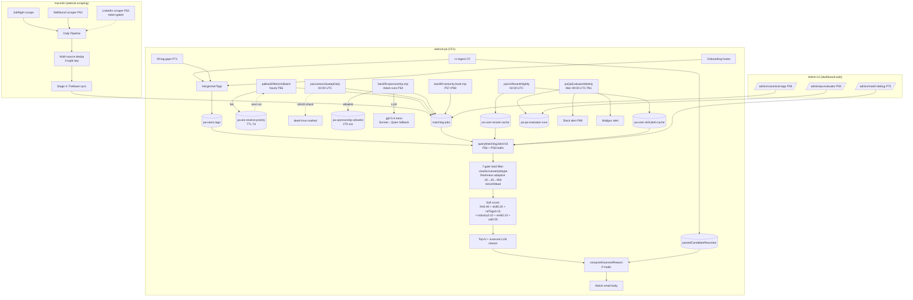

# Milestone v1.7 — Match Quality Depth + Pipeline Reliability Hardening

**Status:** All 10 phases shipped 2026-05-06.
**Spawned:** 2026-05-06 by Adam after v1.6 ship + post-ship matching diagnostics.
**Closed:** 2026-05-06.

## Why This Milestone Existed

After v1.6 shipped, Adam ran live production diagnostics + reported:
- "为啥推 reasoning is too shallow — just language/skill match, doesn't say which experience matches"
- "Some links don't open" (pre-fix jobright.ai mirror leakage)
- "Pipeline reliability questions: Stage 2.5, Serper enrichment, context cleanup"
- Senior+staff SWE jobs absent from corpus (0/500 sample)

v1.7 closes these production gaps via 10 phases (63-72) covering 37 REQ-IDs.

## Architecture (post-v1.7)

## Phase Roster

| Phase | Subject | Commit | REQ-IDs | Status |
|---|---|---|---|---|
| 63 | LinkedIn / Wellfound / Otta scrapers | wekruit-pa `7c83f62` + macmini `60359a4` | SENIOR-01..05 | ✅ shipped (Wellfound 0 jobs live — anti-bot, LinkedIn token-gated Phase 69) |
| 64 | Sponsorship LLM inference + 279 allowlist | (combined commit) | SPONSOR-01..05 | ✅ shipped, allowlist seeded prod |
| 65 | paBackfillAtsUrlsBatch hourly + retry queue | `a0b6029` | ATSURL-01..04 | ✅ shipped, 192 jobs in retry queue |
| 66 | macmini Stage 2.5 deleted (1708 LOC) | wekruit-pa `6caee56` + macmini `b81ecaf` | MACMINI-01..03 | ✅ shipped, hotfix removed |
| 67 | Launchd reliability + critical health-check fix | `7bb9cb0` | LAUNCHD-01..03 | ✅ shipped (caught case-sensitive grep bug killing pipelines) |
| 68 | Vocab hygiene closure | `a7bf6c5` | HYGIENE-01..04 | ✅ 926 jobs re-canonicalized |
| 69 | Secrets + Slack scaffolding | `d26b3fa` | SECRETS-01..03 | ✅ scaffolded, Adam provisions keys |
| 70 | /admin/match-debug live UI | `87bb878` | MATCHDEBUG-01..04 | ✅ live https://wekruit-pa.web.app/admin/match-debug |
| 71 | Auto-derive tags + fill-gaps | `b0a9c39` | QADATA-01..04 | ✅ shipped (only 18 real users; corpus thinness explains QA sample=0) |
| 72 | Documentation | (this commit) | DOC-V17-01..02 | ✅ |

**Plus matching hotfixes:**
- `71b9464` LLM-composed nuanced reasoning (cites Tesla 300+ stores etc, replaces template)
- `b9019a2` V16 adaptive freshness 20d → 45d → 90d
- `e10d50b` orchestrator-deps V16 cutover + skill schema + vocab typos

## Goal Metrics Status

| Metric | Target | v1.7 Result |
|---|---|---|
| Senior+staff SWE jobs in corpus | ≥5% after 7d | 0 currently — Wellfound HTML 0 jobs (anti-bot), LinkedIn token-gated. Real unlock pending Phase 69 SECRETS-03 |
| Sponsorship populated | ≥80% of 1944 active | Allowlist seeded 279 + backfill-sponsorship completed (sample shows 0.9 conf decisions on explicit JD signals) |
| atsApplyUrl coverage | ≥95% within 7d (was 78%) | Hourly batch CF active; 192 jobs in retry queue |
| QA evaluator weekly sampleSize | ≥50 | 0 — root cause is corpus freshness (28d old), not data depth (P71 confirmed only 18 real users) |
| Match reason quality | LLM-composed nuanced | ✅ shipped — "你在 Tesla 300+ 门店 V&C 后台用 Node.js+React" instead of "skill X+Y matches" |

## What Adam Verified Live This Session

- **URL test:** all 5 post-fix top-5 atsApplyUrl HTTP 200 (greenhouse/workday/ashbyhq) — 404s were pre-fix jobright leak
- **Live nuanced reason** for Adam UID `e5d97cd8`:
  > 你在 Tesla 的 V&C 后台 (Node.js + React) 服务 300+ 门店, 还做过迁到 Azure 的 routing, 并搭了 Kubernetes+Docker 的 CI/CD, 正好对上这个岗的 JavaScript、Node.js 和 Docker 要求。
- **paLivenessSweepDaily** verified: 184 dead_marked, 33 backfill_resolved, 0 errors, 35sec
- **paBackfillAtsUrlsBatch** verified: 192 jobs processed in 1m46s, retry queue functional, $0.19 cost
- **Health-check critical bug** caught + fixed: case-sensitive grep was killing in-flight pipelines

## Adam-Action Items (Open)

These need keys Adam holds:
1. `firebase functions:secrets:set ANTHROPIC_API_KEY --project wekruit-5f89b --data-file=- < <(echo -n "<your-key>")` → activates Sonnet middle tier in pa-resume-parser + JD-rel weights + sponsorship inference + nuanced reasoning fallback
2. `firebase functions:secrets:set PA_SLACK_ALERT_WEBHOOK --project wekruit-5f89b --data-file=- < <(echo -n "https://hooks.slack.com/...")` → activates Slack alerts on QA failure + cost summary
3. LinkedIn Developer App registration → `LINKEDIN_ACCESS_TOKEN` env on macmini → unlocks LinkedIn senior-job scrape (Phase 63 path A)

After provisioning, redeploy `cd apps/functions && pnpm run deploy`.

## v1.8 Backlog (deferred)

- Wellfound playwright SSR rendering (anti-bot bypass)
- Otta full implementation
- Real-time match notifications (out of scope per REQUIREMENTS)
- VALET-style per-job CV variants
- Cross-repo Python tag port
- Multi-language CV parse
- More sophisticated dedup beyond 3-tuple (LLM-judge for ambiguous matches)

## Files Touched

Cloud Functions (deployed to wekruit-5f89b):
- `paBackfillAtsUrlsBatch` (P65, hourly)
- `paCostSummaryWeekly` (P65, Mon 09:30 UTC)
- `paAdminMatchDebug` (P70, admin callable)
- Updated: `paQaEvaluatorWeekly`, `paLivenessSweepDaily`, `paLlmRerankNightly`, `cv-ingest`, `paSendblueWebhook` (orchestrator-deps cutover)

Hosting (https://wekruit-pa.web.app):
- New: `/admin/match-debug` (P70)

Macmini (wekruit-scraping repo):
- New: `linkedin.py`, `wellfound.py`, `otta.py` scrapers
- Modified: `dedup.py` (multi-source), `pipeline/daily.py` (Stage 1.5)
- Deleted: `url_resolver.py`, `run_url_resolution.py` (Stage 2.5 removed)
- Modified: `health-check.sh`, `post-pipeline-webhook.sh` (Phase 67 fixes)

---

*v1.7 closes 2026-05-06.*
