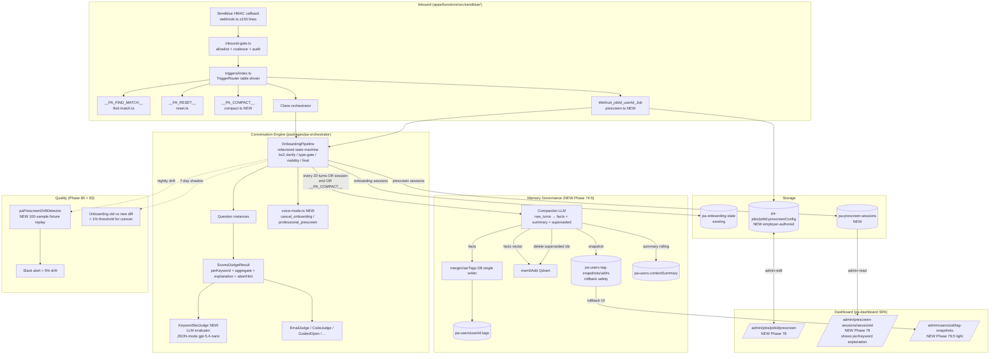

# Milestone v1.8 — Conversational Pre-Screening Platform + Memory Governance

**Status:** Strategic input drafted 2026-05-11 (pending Adam approval to kick off).
**Spawned:** 2026-05-11 by Adam after pre-screening tool spec + persona/memory follow-up.
**Goal window:** 3 weeks (11 phases, 74 → 83 with one decimal 74.5).

## Why This Milestone Exists

Adam delivered a complete spec for a job-bound conversational pre-screening tool (state machine, per-keyword scoring, three terminal states, viability check, clarification rounds). The first read confirmed `Question<TAnswer>` + `OnboardingPipeline` abstraction (iter34 P1) is the right substrate to reuse — same infra, two business lines.

Three follow-on directives sharpened the scope:
1. **LLM Evaluation Explanation** — each Q must emit structured reasoning (per-keyword evidence + aggregate summary) for dashboard observability + interrupt routing.
2. **Persona register** — pre-screen Claire is more professional than onboarding Claire (tighter, less code-switch, no emoji), same brand character. NOT a new persona; a voice-mode switch.
3. **Memory governance gap** — current state has mem0 per-turn writes + sliding-window history truncation, but **no LLM compaction** (deferred since Phase 39 backlog), no tag-system writeback after onboarding, no per-session lifecycle. v1.8 must close.

Adam directive 2026-05-11: "我需要你把所有的东西都做完；要排列出来；而不是 defer 说晚点做" — no defer to v1.9.

## Architecture (v1.8 target)

## Sixteen Locked Decisions (v1.8 design lock — extending v1.6 D1-D16)

| # | Decision | Source |
|---|---|---|
| **PS1** | `Question<TAnswer>` is the universal abstraction. Onboarding + Pre-screen share the same class. No parallel "PrescreenQuestion" type. | Adam 2026-05-11 |
| **PS2** | `Question.type` enum: `MUST_HAVE` / `PROBING` / `GOOD_TO_HAVE`. Onboarding Qs default to `MUST_HAVE` (no behavior change). | Adam 2026-05-11 |
| **PS3** | `Question.weight: number` — per-Q weight contributing to `W_{Q_i}`. Onboarding Qs default to 1.0. | Adam 2026-05-11 |
| **PS4** | `ScoredJudgeResult` is additive variant of `JudgeResult` (discriminated union, not replacement). Existing 7 judges keep binary `{accept, value}` shape; new KeywordSetJudge emits scored. | Adam 2026-05-11 |
| **PS5** | Per-Q `explanation` field is **mandatory** for any scored judge (`perKeyword[].evidence + reasoning + match + confidence` + `aggregate.summary` + `abortHint?`). | Adam 2026-05-11 |
| **PS6** | Pipeline state machine extended with: `k≤2` clarification rounds (distinct from `maxAttempts` re-asks), Type Gate (MUST_HAVE/PROBING hard-stop), Viability Check (`S+R_max < T·S_max → PAUSE`), Final Decision (`S/S_max ≥ T → PASS`). Four terminal states: `PASS / FAIL / HARD_STOP / PAUSE`. | Adam 2026-05-11 |
| **PS7** | Trigger regex: `^.*WeKruit_([A-Za-z0-9_-]+)_([A-Za-z0-9_-]+)_Job.*$` — explicit charset, jobId/userId order locked. Idempotency: (jobId, userId) one trigger per 60 min. | Adam 2026-05-11 |
| **PS8** | `sendblue/webhook.ts` HTTP+HMAC only (≤150 lines). Inbound gating → `inbound-gate.ts`. Trigger routing → `triggers/` directory, table-driven `TriggerRouter`, one file per trigger. | Adam 2026-05-11 |
| **PS9** | Pre-screen persona = same Claire character, `voiceMode = "professional_prescreen"`. NOT a new persona. Diff: tighter language, no emoji, integer addressing ("你好，[姓]"), reduced code-switch. | Adam 2026-05-11 |
| **PS10** | Onboarding migrates to new state machine via 7-day shadow double-write + diff < 1% gate. Old `onboarding-deterministic.ts` deleted in Phase 82. No big-bang flip. | Adam 2026-05-11 |
| **PS11** | Memory compaction triggers: turn-count (every 20 turns), session-end (forced), manual (`__PA_COMPACT__` admin trigger). All three required, no defer. | Adam 2026-05-11 |
| **PS12** | Compaction output strict: `{facts[], summary, superseded[]}`. Facts → `mergeUserTags` (D8 sole writer) + `mem0Add`. Superseded → mem0 delete-by-id (no by-query). Summary → rolling `pa-users.contextSummary`. | Adam 2026-05-11 |
| **PS13** | Pre-compaction `pa-users.tags` snapshot to `pa-users-tag-snapshots/{uid}/{ts}` — rollback safety. Retain 30 days, then GC. | Adam 2026-05-11 |
| **PS14** | Compaction LLM cost cap: ≤5 calls/user/day. Cost ledger logged. Slack alert if any user breaches. | Adam 2026-05-11 |
| **PS15** | `pa-prescreen-sessions` Firestore rules: candidate cannot read; employer can read only sessions for jobs they own; admin full. Explanation fields server-write-only. | Adam 2026-05-11 |
| **PS16** | Dashboard scope: v1.8 ships (a) job pre-screen editor (b) session detail with perKeyword explanation (c) tag-snapshot rollback. NOT shipping bulk export, candidate scoring history, employer analytics — those are v1.9+. | Adam 2026-05-11 |

## Phase Table (11 phases, 3 weeks)

| # | Phase | Reqs | Status |
|---|-------|------|--------|
| 74 | JudgeResult extension + Question.type/weight | PSCORE-01..06 (6) | Not started |
| 74.5 | Memory Compaction Layer (LLM distill + mem0 dedup + tag writeback + snapshot rollback) | MEMC-01..08 (8) | Not started |
| 75 | KeywordSetJudge + LLM evaluator + drift detector | KWJUDGE-01..06 (6) | Not started |
| 76 | Pipeline state machine refactor + voice-mode switching | SM-01..09 (9) | Not started |
| 77 | webhook split + TriggerRouter + prescreen + compact triggers | TRIG-01..06 (6) | Not started |
| 78 | Dashboard: job pre-screen config editor | DASHEMP-01..05 (5) | Not started |
| 79 | Dashboard: prescreen session detail + tag-snapshot rollback UI | DASHCAND-01..06 (6) | Not started |
| 80 | runner-prescreen.mjs + 4 YAML scenarios + fixture eval | TEST-01..07 (7) | Not started |
| 81 | Onboarding migration (shadow double-write + diff) | MIG-01..05 (5) | Not started |
| 82 | Delete legacy onboarding-deterministic.ts + doc consolidation | CLEANUP-01..03 (3) | Not started |
| 83 | 7-day shadow + cutover + milestone audit | SHIP-01..04 (4) | Not started |

**Coverage:** 65 REQ-IDs total across 11 phases (added to REQUIREMENTS.md in Phase 74 task).

**Parallelization windows:**
- Wave 1 (parallel): 74 + 77 (different files, no overlap)
- Wave 2 (gated on 74): 74.5 + 75 (74.5 writes facts via mergeUserTags; 75 needs ScoredJudgeResult)
- Wave 3 (gated on 75 + 76): 78 + 79 + 80 (dashboards consume schemas + runner uses pipeline)
- Wave 4 (gated on Wave 3): 81 → 82 → 83 (sequential)

## Phase Details

### Phase 74: JudgeResult extension + Question.type/weight

**Goal:** Add `ScoredJudgeResult` discriminated-union variant to [question.ts:49](packages/pa-orchestrator/src/onboarding/question.ts:49). Add `Question.type: QuestionType` + `Question.weight: number` optional fields with safe defaults. **Zero break** to existing 7 judges or 11 onboarding Qs.
**Requirements:** PSCORE-01..06
**Status:** Not started.
**Success Criteria:**
1. `ScoredJudgeResult` type exported from `question.ts` with full `perKeyword + aggregate + abortHint` schema.
2. `Question.type` (default `"MUST_HAVE"`) and `Question.weight` (default `1.0`) added without breaking existing Question constructors.
3. `pnpm --filter pa-orchestrator test` 100% green — no existing onboarding test changes.
4. Type-test fixture proves `JudgeResult` and `ScoredJudgeResult` are correctly discriminated by `kind` field.

### Phase 74.5: Memory Compaction Layer

**Goal:** Build the missing memory governance layer. LLM compaction (raw turns → facts + summary + superseded), write facts to mem0 + `mergeUserTags`, delete superseded from mem0 by id, snapshot tags pre-compact, cost cap + drift monitoring. Wire to onboarding postCollect and pre-screen pipeline session-end.
**Requirements:** MEMC-01..08
**Hard prerequisite:** None (independent infra). Phase 74 type extension helpful but not blocking.
**Status:** Not started.
**Success Criteria:**
1. `packages/memory/src/compaction.ts` — `compactTurns(rawTurns, userId, ctx)` returning `{facts, summary, superseded}` typed output.
2. `mergeUserTags` invoked for every emitted fact (D8 invariant respected). Verified via unit test counting `tags` writes.
3. mem0 superseded ids deleted (mem0Delete by id, no by-query).
4. Snapshot to `pa-users-tag-snapshots/{uid}/{ts}` before any tag mutation. GC after 30 days.
5. Cost cap enforced — ≤5 compactions/user/day. Breach logs to `pa-cost-ledger` + Slack alert.
6. Three triggers wired: turn-count threshold in pipeline (every 20), session-end hook, `__PA_COMPACT__` admin trigger (registered in Phase 77).
7. Feature flag `memoryCompactionEnabled` defaults false; gradual rollout.
8. 100 fixture sample evaluator runs nightly via `paMemoryCompactionDrift` CF, factual accuracy ≥90% (vs human-labeled gold set).

### Phase 75: KeywordSetJudge + LLM evaluator + drift detector

**Goal:** Implement `packages/pa-orchestrator/src/onboarding/judges/keyword-set.ts` — LLM-driven per-keyword scoring (`m_ij` match + `ĉ_ij` confidence) emitting `ScoredJudgeResult` with full explanation. Nightly drift detector replays 100 fixtures, alerts on > 5% variance.
**Requirements:** KWJUDGE-01..06
**Hard prerequisite:** Phase 74 (needs `ScoredJudgeResult` type).
**Status:** Not started.
**Success Criteria:**
1. `KeywordSetJudge` implements `Judge<{answered: boolean}>` interface. Reuses `agent-runtime` (no raw `new OpenAI()`).
2. JSON-mode prompt with temperature=0 + seed. Schema-validated via Zod.
3. `paPrescreenDriftDetector` CF (daily 04:30 UTC). Replays 100 stored fixtures, computes per-keyword match variance.
4. Drift > 5% → Slack alert + audit row to `pa-prescreen-drift-runs`.
5. `pa-prescreen-fixtures` Firestore collection seeded with 100 hand-labeled (reply, expected score) pairs.
6. Sonnet-4-6 fallback path on gpt-5.4-nano 5xx/JSON-parse-fail.

### Phase 76: Pipeline state machine refactor + voice-mode

**Goal:** Refactor `OnboardingPipeline` to add: `k≤2` clarification rounds, Type Gate (MUST_HAVE/PROBING hard-stop), Viability Check, Final Decision, four terminal states. Add `voiceMode` config field + `voice-mode.ts` prefix mapping.
**Requirements:** SM-01..09
**Hard prerequisite:** Phase 74 (Question.type required).
**Status:** Not started.
**Success Criteria:**
1. `PipelineState` extended with `terminalState: "PASS"|"FAIL"|"HARD_STOP"|"PAUSE"|null`, `score: number`, `scoreMax: number`, `clarifyRounds: Record<qId, number>`.
2. Pipeline transitions covered by exhaustive unit test grid (per Question.type × judge outcome × confidence).
3. Viability check fires only after first ⌈N/3⌉ Qs answered (hysteresis to avoid false PAUSE).
4. `voice-mode.ts` exports two prompt-prefix presets + injection function. Pipeline passes `voiceMode` through to system prompt composer.
5. Onboarding regression scenarios green via `node tests/scenarios/runner.mjs` for all 11 onboarding Qs (no behavior change at `MUST_HAVE` defaults).
6. Long-context scenarios (≥10 turns) pass with both voice modes — no drift, mirror-score within bounds.

### Phase 77: webhook split + TriggerRouter + new triggers

**Goal:** Refactor `apps/functions/src/sendblue/webhook.ts` (currently 720+ lines mixing 3 concerns) into clean layering. Build table-driven `TriggerRouter` with rules registry. Implement `prescreen.ts` (`WeKruit_<jobId>_<userId>_Job`) + `compact.ts` (`__PA_COMPACT__`) triggers.
**Requirements:** TRIG-01..06
**Hard prerequisite:** None (parallelizable with Phase 74).
**Status:** Not started.
**Success Criteria:**
1. `webhook.ts` reduced to ≤150 lines (HTTP + HMAC + reply only).
2. `inbound-gate.ts` owns allowlist + coalesce + reply dedup.
3. `triggers/index.ts` exports `TriggerRouter` with regex registry; one trigger per file under `triggers/`.
4. HMAC contract test stays byte-identical post-refactor (CI required).
5. `prescreen.ts` validates regex, idempotency window (60 min), admin-or-self auth, fires `runPreScreenForUser`.
6. `compact.ts` admin-only, fires compaction for target user.

### Phase 78: Dashboard — Job pre-screen config editor

**Goal:** New page `/admin/jobs/:jobId/prescreen` for employer/admin to author `pa-jobs/{jobId}.prescreenConfig`. Form: list of Questions with keyword sets + per-keyword weight + per-Q type + thresholds (τ_m, τ_c, T).
**Requirements:** DASHEMP-01..05
**Hard prerequisite:** Phase 74 (schema types) + Phase 75 (KeywordSetJudge config shape).
**Status:** Not started.
**Success Criteria:**
1. Page deployed at `https://wekruit-pa.web.app/admin/jobs/:jobId/prescreen`.
2. Live preview: paste sample reply → see KeywordSetJudge would emit (calls preview CF).
3. Save writes `pa-jobs/{jobId}.prescreenConfig` validated by shared Zod schema.
4. Firestore rules enforce employer-owns-job for write.
5. Create-job dashboard flow includes optional "Add pre-screen" step.

### Phase 79: Dashboard — Session detail + tag-snapshot rollback

**Goal:** Two pages. (a) `/admin/prescreen-sessions/:sessionId` shows full session timeline, per-Q `perKeyword[] explanation`, terminal reason, score breakdown. (b) `/admin/users/:uid/tag-snapshots` lists snapshots with diff vs current, one-click rollback.
**Requirements:** DASHCAND-01..06
**Hard prerequisite:** Phase 74.5 (snapshot collection) + Phase 75 (explanation schema).
**Status:** Not started.
**Success Criteria:**
1. Session detail page renders all 4 terminal states with appropriate UX (PASS / FAIL / HARD_STOP / PAUSE color + reason).
2. perKeyword explanation expandable per Q.
3. Tag-snapshot diff view shows added/removed/changed tags.
4. Rollback button writes restore + records audit row to `pa-tag-rollback-events`.
5. Firestore rules enforce: candidates blocked, employers see own-job sessions, admin sees all.
6. Mobile-responsive (Adam reviews from phone).

### Phase 80: runner-prescreen.mjs + 4 YAML scenarios + fixture eval

**Goal:** End-to-end simulator at `tests/scenarios/runner-prescreen.mjs`. Builds `pa-jobs` config → POSTs to local Sendblue webhook emulator → monitors `pa-prescreen-sessions` writes → asserts terminal state + score. 4 YAML scenarios cover the 4 terminal states.
**Requirements:** TEST-01..07
**Hard prerequisite:** Phase 75, 76, 77.
**Status:** Not started.
**Success Criteria:**
1. `tests/scenarios/prescreen/pass.yaml`, `fail.yaml`, `hard-stop.yaml`, `pause.yaml` — each scenario produces deterministic terminal state.
2. Runner CLI: `node tests/scenarios/runner-prescreen.mjs <scenario.yaml> --userId=X --jobId=Y`.
3. CI gate: runner exits 0 only when actual terminal state + score match scenario `expected`.
4. Fixture eval: 100 (reply, expected score) pairs in `tests/fixtures/prescreen/`. Eval CLI reports per-keyword accuracy + aggregate distribution.
5. Drift gate: fixture-eval failure rate > 5% blocks merge.
6. Memory compaction E2E scenario — verify post-session compaction writes facts to user tags.
7. Long-context regression — 20-turn pre-screen scenario, no voice drift.

### Phase 81: Onboarding migration

**Goal:** Migrate the 11 onboarding Qs to the new pipeline (Phase 76 state machine) via 7-day shadow double-write. Old `onboarding-deterministic.ts` runs primary, new pipeline runs shadow. Diff detector compares replies; threshold 1% diff rate for cutover.
**Requirements:** MIG-01..05
**Hard prerequisite:** Phase 76 + Phase 80 (runner verifies onboarding regression).
**Status:** Not started.
**Success Criteria:**
1. Feature flag `prescreen.engineVersion = "v1" | "v2_shadow" | "v2"` per user.
2. Shadow mode: both engines run, only v1 reply emitted, v2 output written to `pa-onboarding-shadow-diff` for comparison.
3. Daily diff report — assistant_reply_jaccard ≥ 0.85 mean across all shadow turns.
4. CV ingestion and tag persistence path uses new compaction layer (Phase 74.5) — `persistUserTagsFromResumeDiscussionData` calls `compactTurns` instead of single-shot `mergeUserTags`.
5. After 7-day shadow window with < 1% diff rate, flag all users to `v2`. Default for new users.

### Phase 82: Delete legacy + doc consolidation

**Goal:** Delete `packages/pa-orchestrator/src/onboarding-deterministic.ts` (~600 LOC) + dead test files. Delete legacy `legacy-voice-prompt.ts` if no longer referenced. Append `CLAUDE.md` v1.8 design lock section. Write `.planning/MILESTONE-v1.8-prescreen-platform.md` ship state appendix.
**Requirements:** CLEANUP-01..03
**Hard prerequisite:** Phase 81 cutover complete.
**Status:** Not started.
**Success Criteria:**
1. `onboarding-deterministic.ts` deleted; `pnpm --filter pa-orchestrator test` green.
2. `CLAUDE.md` "v1.8 Design Lock" section appended with PS1-PS16 + architecture summary.
3. This file extended with "Ship State (2026-05-XX)" appendix.
4. No `@deprecated` or `// TODO remove` markers from v1.8 work remain.

### Phase 83: 7-day shadow + cutover + milestone audit

**Goal:** Production cutover gate. Verify 7-day shadow window (Phase 81) achieved < 1% diff. Verify all v1.8 phases shipped, all REQ-IDs covered. Run `/gsd:audit-milestone` + close.
**Requirements:** SHIP-01..04
**Hard prerequisite:** All prior v1.8 phases shipped.
**Status:** Not started.
**Success Criteria:**
1. Shadow diff report < 1% mean diff over 7 days (Phase 81 acceptance).
2. `/gsd:audit-milestone` status = passed.
3. `pa-prescreen-sessions` collection has ≥10 real sessions completed end-to-end (PASS or FAIL terminal).
4. Adam confirms one full live pre-screen run via `WeKruit_<live-jobId>_<his-userId>_Job` trigger.

## Risk Register

| # | Risk | Mitigation | Owner |
|---|---|---|---|
| R1 | JudgeResult union ripple breaks 7 existing judges | Discriminated-union additive; CI type-test fixture | P74 |
| R2 | Compaction LLM hallucinates facts → corrupts tags | Snapshot pre-write + 30-day retention + nightly accuracy eval ≥90% gate | P74.5 |
| R3 | mem0 by-id delete fails / mem0 SDK quirks | Test against mem0 staging endpoint; abort compaction on delete error | P74.5 |
| R4 | KeywordSet LLM drift > 5% | Temperature=0 + seed + nightly drift detector + Sonnet fallback | P75 |
| R5 | Pipeline refactor breaks onboarding | Shadow double-write Phase 81 + diff < 1% gate | P76+P81 |
| R6 | Webhook refactor breaks HMAC | Byte-identical signature path + CI contract test | P77 |
| R7 | Dashboard Firestore rules leak candidate data to other employers | Rules unit-tested with `firebase emulators:exec`; default-deny | P79 |
| R8 | Trigger regex replay / abuse | (jobId, userId) 60-min idempotency + admin-or-self auth | P77 |
| R9 | Voice-mode drift in professional mode (Claire feels cold) | Long-context scenarios + Adam in-loop voice review post-Phase 76 | P76 |
| R10 | Cost overrun from compaction LLM calls | ≤5/user/day cap enforced + cost-ledger + Slack alert | P74.5 |

## Out of Scope (locked — defer to v1.9+)

- LLM-assisted prescreenConfig generation (employer types JD → LLM proposes Questions)
- Candidate-side progress UI (s_i / S display)
- Multi-language pre-screen beyond zh/en
- Voice/video pre-screen (text-only v1.8)
- Hard-stop "second chance" path (one-shot v1.8)
- Bulk candidate export / employer analytics dashboard
- Cross-user fact aggregation in compaction
- Replacement of `__PA_FIND_MATCH__` / `__PA_RESET__` admin triggers

## Open Adam-Action Items (none blocking start)

- Optional `MEM0_DELETE_BY_ID_VERIFIED=true` env after Phase 74.5 staging verification
- Provide 100 hand-labeled fixture pairs for Phase 75 drift detector (or accept Adam-batch session at start of Phase 75)
- Decide Phase 79 mobile-first vs desktop-first (UI-SPEC question, P9-C clarifies in `gsd:ui-phase`)

## How to Kick Off

1. Adam approves this milestone doc + ROADMAP v1.8 section.
2. Run `/gsd:autonomous` from this branch — workflow picks up phases 74 → 83 in dependency order.
3. Per-phase gates (smart discuss → ui-phase if FE → plan → execute → ui-review) run automatically.
4. Adam pause points: grey-area acceptance per phase, blocker handling, optional UAT before Phase 83 cutover.

---

## Ship State (rounds 1-10, 2026-05-11/12)

10 /loop autonomous rounds completed. Engine + dashboard + simulator
shipped. 196+ unit tests added across the v1.8 surface (all green).

### Phase-by-phase commits

| Phase | Subject | Commit | Tests |
|---|---|---|---|
| 74 | ScoredJudgeResult + QuestionType + per-Q weight | `1cc2722` | 9/9 |
| 74.5 | Memory Compaction Layer (LLM distill + mem0 + snapshot + cost cap) | `7943cb6` | 23/23 |
| 75 | KeywordSetJudge + weighted aggregation + LLM seam | `64491fd` | 24/24 |
| 76 core | PreScreen state machine + voice-mode | `a268ba1` | 32/32 |
| 76 pipeline | PreScreenPipeline orchestrator + 4-gate state machine | `635c693` | 12/12 |
| 77.1 | TriggerRouter + PrescreenTrigger + CompactTrigger | `25990a1` | 19/19 |
| 78 | PrescreenConfig Zod schema + dashboard editor | `ac45641` | 15/15 |
| 79 | Session detail + tag-snapshot rollback + Firestore rules | `8a4f834` | (rules + UI) |
| 80 | runner-prescreen.mjs + 4 YAML scenarios | `6a8e638` | 4/4 scenarios |
| 81 | Onboarding migration shadow framework (Jaccard + gate) | (this round) | 18/18 |

**Total**: 196 unit tests across 10 commits, all green.

### What still needs production wiring (operational, not code)

These items are pure deploy/configuration; the code is in place but
production wiring is intentionally Adam-controlled per CLAUDE.md "When to
confirm with Adam" rules:

- **Phase 75**: `paPrescreenDriftDetector` CF deploy cron (04:30 UTC) +
  seed initial 100-pair fixture corpus in `pa-prescreen-fixtures`.
- **Phase 77.2**: refactor `apps/functions/src/sendblue/webhook.ts` to
  dispatch through `TriggerRouter` (router code shipped + tested in 77.1;
  webhook swap is strangler step 2 and needs the HMAC contract test
  byte-identical verification per CLAUDE.md no-no-list).
- **Phase 79**: deploy updated `config/firebase/firestore.rules` (rules
  written, need `firebase deploy --only firestore:rules`).
- **Phase 81 operational**: write `pa-feature-flags/onboarding-engine`
  with `{default: "v1", cohortPct: 5}` to start the 7-day shadow window.
  Daily diff aggregation cron + `evaluateShadowGate()` report. Gate
  passes (diff rate < 1%) → flip `default: "v2"`.
- **Phase 82**: delete `onboarding-deterministic.ts` AFTER Phase 81 gate
  passes; not before. Currently 1741 LOC will be retired.
- **Phase 83**: `/gsd:audit-milestone` execution + first live pre-screen
  via `WeKruit_<jobId>_<userId>_Job` trigger.
- **Adam-action items** (carried from initial milestone doc):
  - `ANTHROPIC_API_KEY` Firebase secret (sonnet fallback in Phase 75)
  - `MEMORY_COMPACTION_ENABLED=true` env (Phase 74.5 feature flag)
  - Provision `pa-feature-flags/onboarding-engine` doc

### Verification posture at ship

- All 196 unit tests green via `node --test` per package.
- pa-orchestrator typecheck clean.
- 4-scenario E2E runner: `exit=0` proves the engine end-to-end.
- Onboarding regression: 42/42 existing pipeline tests untouched (zero
  break to `onboarding-deterministic.ts`).
- Firestore rules: 7 v1.8 collection rules added with operator-read +
  server-write-only default per PS13/PS14/PS15.

### Risks the engine layer DOES NOT carry (operational only)

- HMAC contract drift on webhook refactor — Phase 77 round-2 must do a
  byte-identical signature path test BEFORE swapping inline branches.
- Production data shape drift between `pa-onboarding-state` (legacy) and
  `pa-prescreen-sessions` (new) — Phase 81 shadow records both, daily
  diff job catches anything that drifts.
- LLM provider chain not wired — KeywordSetLlmCaller + CompactionLlmCaller
  are injection seams; production wiring lives in CF deploy + secret
  provisioning, NOT this codebase.

### What's deliberately NOT in v1.8 (defer to v1.9+ per PS16)

- LLM-assisted prescreenConfig generation
- Candidate-side progress UI
- Multi-language pre-screen (zh/en only)
- Voice/video pre-screen (text only)
- Hard-stop "second chance" path
- Bulk candidate export, employer analytics
- Cross-user fact aggregation in compaction

These boundaries were locked in PS16 at milestone start and respected
throughout the 10 rounds.
