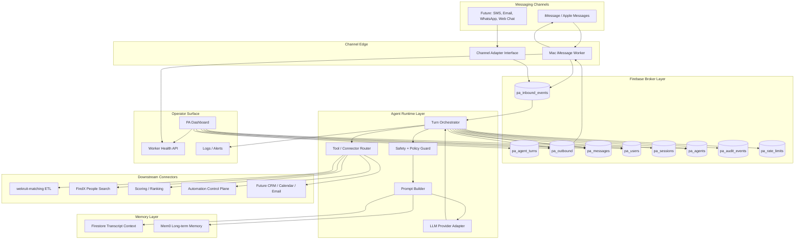
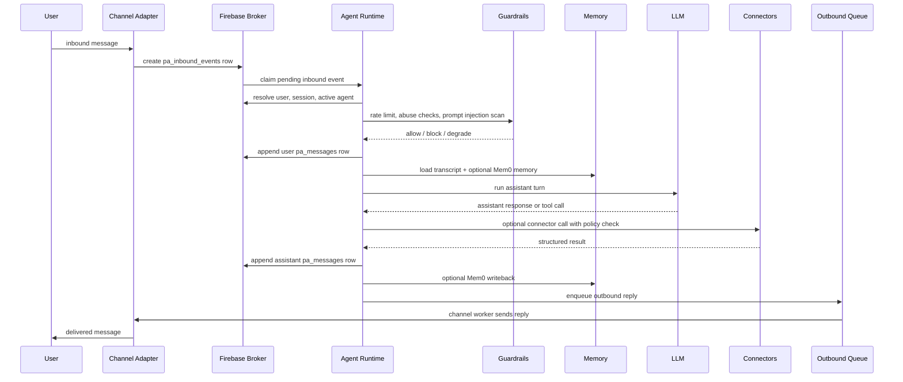

# WeKruit PA Architecture

## Product Target

WeKruit PA is a multi-user personal assistant platform.

Users message WeKruit directly through iMessage first, with future channels added behind the same broker. Each user gets a private assistant, transcript, memory, and controlled access to downstream WeKruit systems such as matching, FindX, scoring, ETL, and automations.

The product must support:

- many users messaging concurrently
- per-user assistant selection and memory
- durable message queues so worker restarts do not lose work
- operator dashboard for user, agent, health, and queue visibility
- abuse controls: rate limits, prompt injection protection, connector allowlists, audit logs
- downstream connectors for matching, search, scoring, workflow automation, and future tools

## Final Target Architecture

## Message Processing Sequence

## Why Firebase Broker Is Required

The worker can restart, the Mac can sleep, iMessage can delay rows, LLM calls can timeout, and downstream connectors can fail. Directly doing "message received -> run agent -> send reply" in one process is not enough for production.

Target behavior:

- inbound adapter writes a durable `pa_inbound_events` row before agent work starts
- agent runtime claims events transactionally
- each event has state: `pending`, `processing`, `completed`, `failed`, `dead_letter`
- outbound replies are written to `pa_outbound` before the channel worker sends
- retries are bounded by idempotency keys
- broken turns can be resumed from Firestore, not from local worker memory

## Core Firestore Collections

Existing collections:

- `pa_users`: user profile, channel handles, active agent, onboarding state
- `pa_sessions`: channel session/thread identity
- `pa_messages`: transcript source of truth
- `pa_agents`: assistant config, prompt, provider, model, `memoryMode`
- `pa_remote_config`: platform flags, kill switch, model override
- `pa_outbound`: outbound message queue

Target additions:

- `pa_inbound_events`: raw inbound event queue from channel adapters
- `pa_agent_turns`: runtime state for each assistant turn
- `pa_tool_calls`: connector call ledger and retry state
- `pa_audit_events`: operator, agent, policy, connector audit log
- `pa_rate_limits`: per-user and per-channel counters
- `pa_abuse_events`: blocked messages, injection signals, suspicious behavior

## Agent Runtime

Current state:

- `packages/agent-runtime` exists.
- It can build OpenAI-compatible messages and run one assistant turn.
- It is not yet a full orchestration layer.

Target runtime responsibilities:

- claim inbound events from Firebase
- resolve `userId`, `sessionId`, `activeAgentId`
- load transcript from Firestore
- load optional Mem0 memory according to `pa_agents.memoryMode`
- build the prompt with policy-controlled context
- call LLM provider adapter
- handle tool calls through the connector router
- write assistant response and turn state
- enqueue outbound reply
- emit audit, health, and metrics events

## Memory Model

Firestore is durable transcript storage. Mem0 is optional long-term personalization.

Modes:

- `firestore_only`: use recent `pa_messages`; no Mem0 read or write
- `mem0`: use Mem0 search and writeback; Firestore still stores transcript
- `both`: same as Mem0 plus Firestore transcript context; currently equivalent in code path to Mem0 + transcript

Memory must not be the only copy of conversation history. If Mem0 is unavailable, the assistant should degrade to Firestore transcript context and log the reason.

## Connector Layer

Connectors are not direct arbitrary tools exposed to the model. They should be registered capabilities with schemas, policies, and audit logs.

Connector contract:

- name and version
- input schema
- output schema
- permission policy
- timeout and retry policy
- audit payload
- allowed agent ids or tool policy groups

Initial connectors:

- `wekruit-matching`: run candidate/job matching ETL
- `findx`: find or enrich a person/company
- `scoring`: rank, score, or classify a candidate
- `automation`: schedule or run approved workflows
- `dashboard-actions`: operator-approved state changes

## Abuse And Safety Controls

Required controls:

- per-user rate limits
- per-channel rate limits
- per-agent tool budget
- global kill switch
- connector allowlists
- prompt injection detection before tool use
- memory write filtering so injected instructions are not stored as facts
- PII redaction for logs
- operator audit trail
- dead-letter queue for repeated failures

Safety placement:

- message-level checks before `pa_messages` write
- prompt-level checks before LLM call
- tool-level checks before connector execution
- memory-level checks before Mem0 writeback
- outbound-level checks before sending a reply

## Current Architecture

Current implementation already has:

- Vite dashboard in `apps/dashboard-web`
- macOS iMessage worker in `apps/macos-imessage-worker`
- Firestore namespace `pa_*`
- Admin SDK package
- core schemas package
- memory package with Firestore transcript + optional Mem0
- agent runtime package for OpenAI-compatible single turns
- agent registry package
- worker health endpoint
- outbound Firestore listener
- iMessage phone and email participant handling

Current gaps:

- no durable `pa_inbound_events` queue yet
- no `pa_agent_turns` state machine yet
- agent runtime is a provider wrapper, not an orchestrator
- connector router does not exist yet
- prompt injection and abuse policy are not formalized
- Mem0 deployment is documented but not provisioned
- dashboard does not yet expose queue, turn, connector, and abuse operations as a complete control plane
- iMessage worker still carries too much orchestration logic

