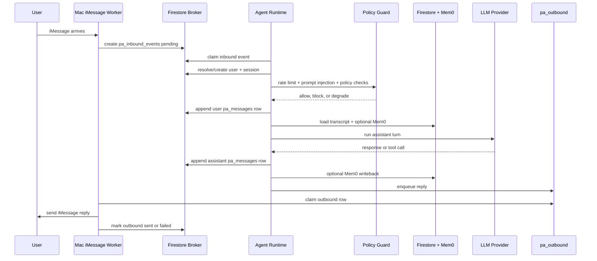
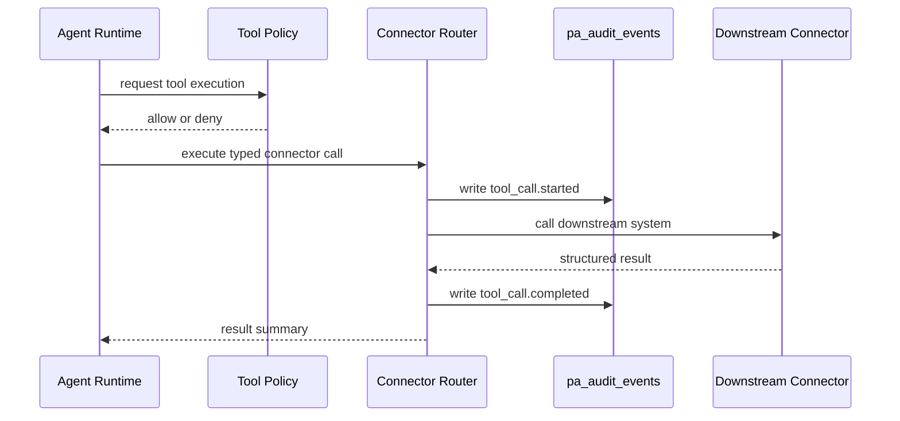
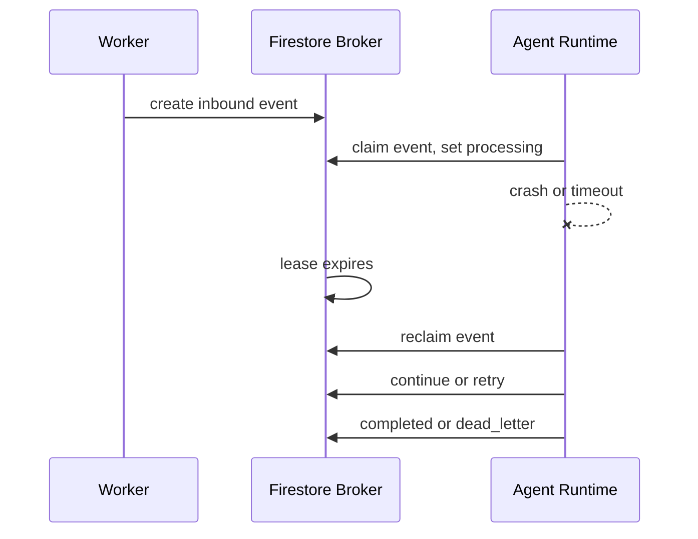

# Runtime Sequences

## Inbound Message With Broker

```mermaid
sequenceDiagram
  participant User
  participant Worker as Mac iMessage Worker
  participant Broker as Firestore Broker
  participant Runtime as Agent Runtime
  participant Guard as Policy Guard
  participant Memory as Firestore + Mem0
  participant LLM as LLM Provider
  participant Outbox as pa_outbound

  User->>Worker: iMessage arrives
  Worker->>Broker: create pa_inbound_events pending
  Runtime->>Broker: claim inbound event
  Runtime->>Broker: resolve/create user + session
  Runtime->>Guard: rate limit + prompt injection + policy checks
  Guard-->>Runtime: allow, block, or degrade
  Runtime->>Broker: append user pa_messages row
  Runtime->>Memory: load transcript + optional Mem0
  Runtime->>LLM: run assistant turn
  LLM-->>Runtime: response or tool call
  Runtime->>Broker: append assistant pa_messages row
  Runtime->>Memory: optional Mem0 writeback
  Runtime->>Outbox: enqueue reply
  Worker->>Outbox: claim outbound row
  Worker->>User: send iMessage reply
  Worker->>Broker: mark outbound sent or failed
```

## Connector Call

```mermaid
sequenceDiagram
  participant Runtime as Agent Runtime
  participant Policy as Tool Policy
  participant Router as Connector Router
  participant Audit as pa_audit_events
  participant Tool as Downstream Connector

  Runtime->>Policy: request tool execution
  Policy-->>Runtime: allow or deny
  Runtime->>Router: execute typed connector call
  Router->>Audit: write tool_call.started
  Router->>Tool: call downstream system
  Tool-->>Router: structured result
  Router->>Audit: write tool_call.completed
  Router-->>Runtime: result summary
```

## Failure And Resume

```mermaid
sequenceDiagram
  participant Worker
  participant Broker as Firestore Broker
  participant Runtime as Agent Runtime

  Worker->>Broker: create inbound event
  Runtime->>Broker: claim event, set processing
  Runtime--xRuntime: crash or timeout
  Broker->>Broker: lease expires
  Runtime->>Broker: reclaim event
  Runtime->>Broker: continue or retry
  Runtime->>Broker: completed or dead_letter
```

